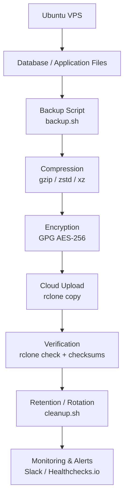
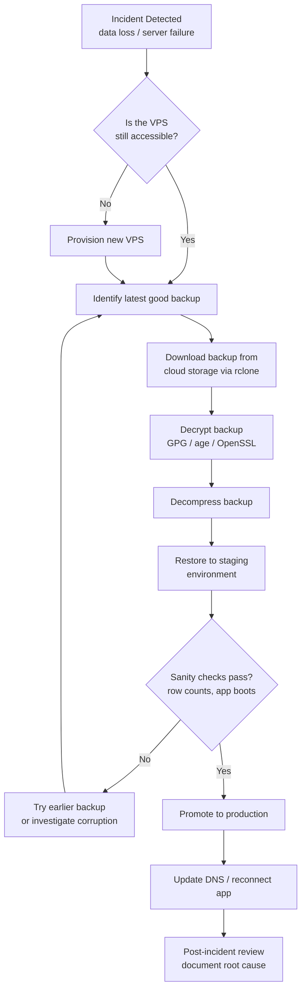
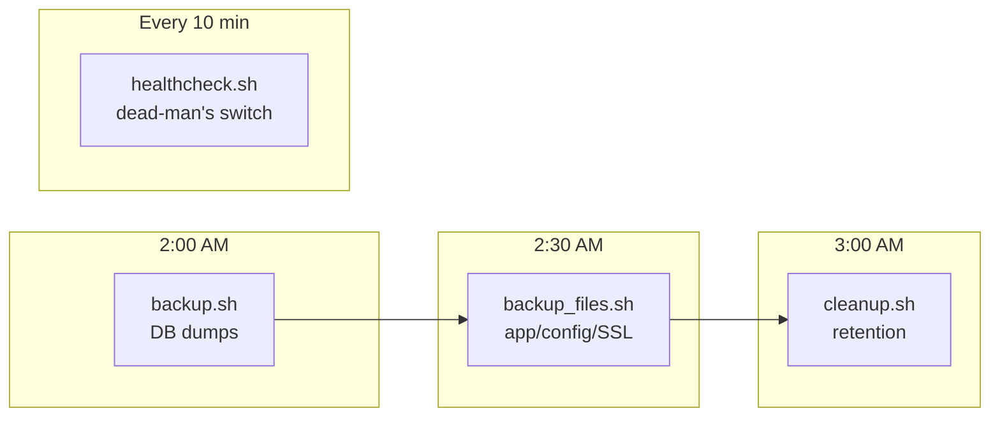

# The Complete Ubuntu VPS Database Backup Guide

### From Zero to Automated, Encrypted, Cloud-Synced Backups for Any Database

---

## About This Guide

This is a practical, end-to-end reference manual for backing up databases and files on an Ubuntu VPS, and shipping those backups automatically to cloud storage. It's written for someone comfortable with basic Linux (SSH, editing files, running commands) who has never built an automated backup pipeline before. By the end, you'll have working scripts, a cron schedule, encrypted archives, cloud uploads, retention policies, and monitoring — the same architecture used in production environments.

Every command below is meant to be copy-pasted. Every command is also explained, so you understand *why* you're running it, not just what it does.

---

## Table of Contents

1. [Backup Fundamentals](#part-1--backup-fundamentals)
2. [Ubuntu Server Preparation](#part-2--ubuntu-server-preparation)
3. [Database Backup Methods](#part-3--database-backup-methods)
   - [MongoDB](#mongodb) · [MySQL](#mysql) · [MariaDB](#mariadb) · [PostgreSQL](#postgresql) · [SQLite](#sqlite) · [Redis](#redis) · [Elasticsearch](#elasticsearch) · [InfluxDB](#influxdb) · [Cassandra](#cassandra) · [Files & Folders](#any-folder--file-backup)
4. [Compression](#part-4--compression)
5. [Encryption](#part-5--encryption)
6. [Cloud Storage Providers](#part-6--cloud-storage)
7. [Complete rclone Guide](#part-7--rclone-complete-guide)
8. [Automation with Cron](#part-8--automation)
9. [Backup Rotation & Retention](#part-9--backup-rotation)
10. [Monitoring & Alerting](#part-10--monitoring)
11. [Restore Procedures](#part-11--restore-procedures)
12. [Security](#part-12--security)
13. [Production Best Practices](#part-13--production-best-practices)
14. [Example Project (Full Script Suite)](#part-14--example-project)
15. [Complete Backup Architecture (Diagrams)](#part-15--complete-backup-architecture)
16. [Troubleshooting](#part-16--troubleshooting)
17. [Cheat Sheet](#part-17--cheat-sheet)

---

## Part 1 — Backup Fundamentals

### What Is a Backup?

A backup is a copy of your data, stored somewhere separate from the original, that you can use to restore service after data loss. Data loss can come from many directions: a bad `DROP TABLE`, a failed disk, a ransomware attack, an accidental `rm -rf`, a botched migration, or a VPS provider losing a data center. A backup is only useful if it is:

- **Complete** — it contains everything needed to restore the system to a working state.
- **Recent** — it was taken close enough to the failure that you don't lose unacceptable amounts of data.
- **Tested** — you've actually verified it can be restored, not just that the file exists.
- **Separate** — it does not live on the same disk, server, or account as the original data (otherwise a single failure destroys both).

A file sitting next to your database on the same disk is not a backup. It's a copy. A backup implies isolation from the failure that might destroy the original.

### Why Backups Matter

Most people don't take backups seriously until they lose something irreplaceable. On a production server, the cost of *not* having backups is not "some inconvenience" — it's the entire business. Common triggers where backups save you:

- Human error (accidental deletes, bad migrations, bad deploys)
- Hardware failure (disk corruption, VPS host failure)
- Security incidents (ransomware, compromised credentials, malicious insiders)
- Software bugs that silently corrupt data over time
- Regulatory and compliance requirements (many industries require retained, auditable backups)

### Backup Terminology

**Full backup**
A complete copy of all the data at a point in time. Simple to restore (just one file/set), but the most expensive in storage and time to create repeatedly.

**Incremental backup**
Only the data that changed *since the last backup* (full or incremental) is saved. Fast and space-efficient, but restoring requires the last full backup plus every incremental since, applied in order.

**Differential backup**
Only the data that changed *since the last full backup* (not since the last differential). Larger than incrementals over time, but restoring only needs the last full + the last differential — simpler than incremental chains.

**Snapshot**
A point-in-time, often storage/filesystem-level, image of data (e.g., an LVM snapshot, a cloud disk snapshot, or a database engine's internal snapshot mechanism). Snapshots are typically fast to create because they use copy-on-write rather than copying every byte immediately.

**Archive**
A single file bundling many files/directories together (commonly a `.tar` file), usually before compression. "Archiving" refers to the bundling step, distinct from compression or encryption.

**Compression**
Reducing the size of backup data using an algorithm (gzip, xz, zstd, etc.) so it takes less disk space and less time/bandwidth to transfer.

**Encryption**
Scrambling backup data with a key/passphrase so that anyone who obtains the backup file without the key cannot read its contents. Essential for backups containing sensitive data, especially once they leave your server.

### RPO — Recovery Point Objective

RPO answers: *"How much data can we afford to lose?"* If your RPO is 24 hours, backups taken once daily are acceptable — you might lose up to a day of data in the worst case. If your RPO is 5 minutes, you need continuous replication or very frequent incremental backups, not just nightly dumps.

### RTO — Recovery Time Objective

RTO answers: *"How long can we be down while we restore?"* An RTO of 4 hours means your restore process — including finding the backup, decrypting it, downloading it, and importing it — must complete within 4 hours. RTO drives decisions like: do you need local + cloud copies (faster local restore), or is a fully scripted, one-command restore process necessary?

### The 3-2-1 Backup Rule

A widely used rule of thumb for backup resilience:

- **3** copies of your data (the original + 2 backups)
- **2** different storage media/systems (e.g., local disk + cloud storage)
- **1** copy stored off-site (a different physical location / provider than the original server)

This guide's architecture — a local backup on the VPS, then an off-site copy in cloud storage — satisfies the "2 different media" and "1 off-site" parts. Adding a second cloud provider or region gets you closer to full 3-2-1 resilience.

### Cold Backup vs. Hot Backup

**Cold backup**: taken while the database (or relevant service) is stopped. Guarantees a perfectly consistent snapshot because nothing can write during the backup, but requires downtime.

**Hot backup**: taken while the database is running and actively serving traffic. Requires backup tools that understand the database's internal consistency mechanisms (transaction logs, locks, snapshots) so the backup isn't corrupted by concurrent writes. Most production backup tools (`mysqldump`, `pg_dump`, `mongodump`) are designed to take safe hot backups.

### Point-in-Time Recovery (PITR)

The ability to restore a database to an exact moment in time (e.g., "right before the bad migration ran at 14:32") rather than just to the last full backup. This requires combining a full backup with a continuous log of changes (binary logs in MySQL, WAL in PostgreSQL, oplog in MongoDB) and replaying those logs up to the desired timestamp.

### Disaster Recovery (DR)

The broader plan for restoring full service after a major failure — not just data, but infrastructure, DNS, configuration, and application code. A backup strategy is one component of a disaster recovery plan; DR also covers things like standby servers, runbooks, and communication plans.

### Choosing Full vs. Incremental vs. Differential for Your Setup

Most single-VPS setups in this guide default to **daily full backups** for simplicity — a full `mysqldump`, `pg_dump`, or `mongodump` every night. This is the right starting point because it makes every restore a one-step operation: grab one file, restore it, done.

Consider incremental or differential strategies once you hit one of these signals:

- The full backup takes so long it starts overlapping with the next scheduled run, or noticeably impacts application performance while running.
- Your RPO requirement is tighter than "once per day" and a full dump every hour is too expensive in CPU/storage/bandwidth.
- Your dataset is large enough (many tens of GB+) that daily full backups meaningfully strain disk space or network egress budgets.

In practice, most engines implement this not as "incremental dumps" but as **continuous log shipping** layered on top of periodic full backups — MySQL binary logs, PostgreSQL WAL archiving, MongoDB oplog tailing. A full backup taken nightly, combined with continuously archived logs, gives you both efficient storage *and* point-in-time recovery, which a naive incremental-dump chain does not give you on its own.

**Example: PostgreSQL continuous WAL archiving for point-in-time recovery**, layered on top of the nightly `pg_dump`/`pg_basebackup`:

```bash
# postgresql.conf
archive_mode = on
archive_command = 'rclone copy %p s3:yourcompany-backups/wal/%f --config /backup/config/rclone.conf'
```

This ships every completed WAL segment to cloud storage as it's generated, in addition to the nightly base backup, enabling restore to any point in time — not just to the moment of the last nightly dump.

**Example: MySQL binary logging for the same purpose:**

```ini
# my.cnf
[mysqld]
log-bin=/var/log/mysql/mysql-bin
binlog_expire_logs_seconds=604800
```

Binary logs can be replayed after restoring a full `mysqldump` using `mysqlbinlog`, to roll forward to a specific timestamp rather than only to last night's backup.


---

## Part 2 — Ubuntu Server Preparation

Before building any backup system, get the VPS itself into a clean, predictable state and install the tools every later section depends on.

### Step 1: Update the System

```bash
sudo apt update && sudo apt upgrade -y
```

- `apt update` refreshes the local package index (the list of available packages and versions) from Ubuntu's repositories. It does not install anything by itself.
- `apt upgrade -y` installs newer versions of already-installed packages. `-y` auto-confirms the prompt.

Run this before installing anything new, so you're building on a current package index.

### Step 2: Create a Dedicated Backup User (Recommended)

Running backup scripts as `root` is a common but risky habit — a bug or compromised script then has full system access. Create a limited user instead:

```bash
sudo adduser backupuser
sudo usermod -aG sudo backupuser   # optional: only if it truly needs sudo for specific tasks
```

You'll grant this user only the specific database privileges it needs (covered in Part 12 — Security), not blanket root access.

### Step 3: Install Required Packages

```bash
sudo apt install -y cron tar gzip zip unzip xz-utils rsync curl wget gnupg
```

**What each tool does:**

| Tool | Purpose |
|---|---|
| `cron` | The daemon that runs scheduled jobs (your daily backups). Usually pre-installed on Ubuntu, but installing ensures it's present and enabled. |
| `tar` | Bundles multiple files/directories into a single archive file (a "tarball"). The foundation of most backup archives. |
| `gzip` | Fast, widely-supported compression. Often used together with `tar` (`tar czf`). |
| `zip` | Cross-platform compression/archiving, useful when backups may be opened on Windows. |
| `xz-utils` | Provides `xz`, a slower but much higher-ratio compression tool — good for backups where storage cost matters more than CPU time. |
| `rsync` | Efficiently syncs files/directories, transferring only the differences. Useful for local copies, remote copies over SSH, and mirroring. |
| `curl` / `wget` | Command-line tools for downloading files and making HTTP requests. Used to install `rclone`, hit healthcheck URLs, and call webhook APIs (Slack/Discord/Telegram). |
| `gnupg` | Provides `gpg`, used for encrypting backup archives with strong, well-audited encryption (Part 5). |

### Step 4: Install rclone

`rclone` is the tool this guide uses to sync backups to virtually any cloud storage provider (S3, Google Drive, Backblaze B2, Azure, Dropbox, and more) with one consistent command syntax. Install the latest version directly from the official installer rather than the (often outdated) Ubuntu repo version:

```bash
curl https://rclone.org/install.sh | sudo bash
```

Verify installation:

```bash
rclone version
```

### Step 5: Confirm Cron Is Running

```bash
sudo systemctl status cron
```

You should see `active (running)`. If not:

```bash
sudo systemctl enable --now cron
```

- `enable` makes cron start automatically on every boot.
- `--now` also starts it immediately, without needing a reboot.

### Step 6: Create the Backup Directory Structure

```bash
sudo mkdir -p /backup/{scripts,logs,config,database,tmp}
sudo chown -R backupuser:backupuser /backup
sudo chmod -R 750 /backup
```

- `mkdir -p /backup/{scripts,logs,config,database,tmp}` creates all five subdirectories in one command using brace expansion.
- `chown -R backupuser:backupuser /backup` makes the backup user the owner of the whole tree, recursively.
- `chmod -R 750 /backup` restricts permissions: owner can read/write/execute, group can read/execute, others get nothing. Backups often contain sensitive data — don't leave them world-readable.

This directory layout is used throughout the rest of the guide, and matches the full example project in Part 14.

### Step 7: Set the Server Timezone (Important for Scheduling)

```bash
sudo timedatectl set-timezone UTC
timedatectl
```

Using UTC avoids daylight-saving-time confusion in cron schedules and log timestamps — especially important if your team spans multiple timezones. Substitute your preferred timezone (e.g. `Asia/Kolkata`) if you have a strong reason to use local time instead.

---

## Part 3 — Database Backup Methods

This section covers backup and restore procedures for every major database engine, plus general file/folder backups. Each section is self-contained — jump directly to the database you use.

### MongoDB

MongoDB stores data as BSON (Binary JSON) — a binary-encoded superset of JSON that supports additional types like dates and raw binary data, and is more compact and faster to parse than text JSON. MongoDB's native backup tool, `mongodump`, exports collections directly in BSON, which `mongorestore` can load back in without any conversion.

**Install the MongoDB Database Tools** (if not already present):

```bash
sudo apt install -y mongodb-database-tools
```

**Backup a single database:**

```bash
mongodump --db=myapp --out=/backup/database/mongodb/$(date +%F)
```

- `--db=myapp` limits the dump to the `myapp` database only.
- `--out=...` sets the output directory. `$(date +%F)` inserts today's date (`YYYY-MM-DD`), so each day's backup lands in its own folder.

**Backup the entire cluster (all databases):**

```bash
mongodump --out=/backup/database/mongodb/$(date +%F)_full
```

Omitting `--db` dumps every database the connecting user can access.

**Backup a specific collection:**

```bash
mongodump --db=myapp --collection=orders --out=/backup/database/mongodb/$(date +%F)_orders
```

**Compressed backup (recommended for daily jobs):**

```bash
mongodump --db=myapp --gzip --out=/backup/database/mongodb/$(date +%F)
```

`--gzip` compresses each BSON file as it's written, saving disk space with negligible extra effort.

**With authentication (typical for production):**

```bash
mongodump --host=127.0.0.1 --port=27017 \
  --username=backupuser --password="$MONGO_PASS" \
  --authenticationDatabase=admin \
  --db=myapp --gzip --out=/backup/database/mongodb/$(date +%F)
```

Note `$MONGO_PASS` is read from an environment variable, not hardcoded — see Part 12 for why this matters.

**Restore with mongorestore:**

```bash
mongorestore --db=myapp --gzip /backup/database/mongodb/2026-08-05/myapp
```

To restore a full cluster dump:

```bash
mongorestore --gzip /backup/database/mongodb/2026-08-05_full
```

Add `--drop` to drop existing collections before restoring, ensuring a clean restore that exactly matches the backup rather than merging with existing data:

```bash
mongorestore --drop --gzip --db=myapp /backup/database/mongodb/2026-08-05/myapp
```

---

### MySQL

**Backup a single database:**

```bash
mysqldump -u backupuser -p"$MYSQL_PASS" myapp > /backup/database/mysql/myapp_$(date +%F).sql
```

- `-u backupuser` specifies the MySQL user.
- `-p"$MYSQL_PASS"` supplies the password from an environment variable (no space between `-p` and the value).
- `myapp` is the database name; output is redirected (`>`) into a `.sql` file containing plain-text SQL statements that recreate the schema and data.

**Backup all databases:**

```bash
mysqldump -u backupuser -p"$MYSQL_PASS" --all-databases > /backup/database/mysql/all_$(date +%F).sql
```

**Compressed backup (pipe directly into gzip, avoiding a large intermediate file):**

```bash
mysqldump -u backupuser -p"$MYSQL_PASS" myapp | gzip > /backup/database/mysql/myapp_$(date +%F).sql.gz
```

**Transaction-safe backup (for InnoDB tables, avoids locking the whole database):**

```bash
mysqldump -u backupuser -p"$MYSQL_PASS" \
  --single-transaction --quick --routines --triggers --events \
  myapp | gzip > /backup/database/mysql/myapp_$(date +%F).sql.gz
```

- `--single-transaction` starts a transaction with a consistent snapshot (via InnoDB's MVCC), so the dump is consistent without locking tables — safe for a live, hot backup.
- `--quick` streams rows one at a time instead of buffering the whole table in memory, important for large tables.
- `--routines --triggers --events` include stored procedures, triggers, and scheduled events, which are otherwise silently skipped.

**Restore:**

```bash
gunzip < /backup/database/mysql/myapp_2026-08-05.sql.gz | mysql -u backupuser -p"$MYSQL_PASS" myapp
```

The target database (`myapp`) must already exist; create it first if restoring to a fresh server:

```bash
mysql -u root -p -e "CREATE DATABASE myapp CHARACTER SET utf8mb4;"
```

---

### MariaDB

MariaDB is a drop-in fork of MySQL and uses the same client tools and syntax — `mysqldump` and `mysql` work identically. Everything in the MySQL section above applies verbatim to MariaDB. The only difference you may encounter is that some newer MariaDB installations also ship `mariadb-dump` and `mariadb` as aliases:

```bash
mariadb-dump -u backupuser -p"$MYSQL_PASS" --single-transaction myapp | gzip > /backup/database/mariadb/myapp_$(date +%F).sql.gz
```

---

### PostgreSQL

**Backup a single database with pg_dump:**

```bash
PGPASSWORD="$PG_PASS" pg_dump -U backupuser -h 127.0.0.1 -d myapp -F c -f /backup/database/postgres/myapp_$(date +%F).dump
```

- `-F c` uses PostgreSQL's custom compressed archive format — smaller than plain SQL and required for parallel restore.
- `-f` sets the output file path.
- Setting `PGPASSWORD` as an inline environment variable avoids an interactive password prompt without hardcoding it in a script file.

**Plain SQL backup (human-readable, useful for diffing/version control):**

```bash
PGPASSWORD="$PG_PASS" pg_dump -U backupuser -h 127.0.0.1 -d myapp | gzip > /backup/database/postgres/myapp_$(date +%F).sql.gz
```

**Backup the entire cluster, including roles and all databases, with pg_dumpall:**

```bash
PGPASSWORD="$PG_PASS" pg_dumpall -U backupuser -h 127.0.0.1 | gzip > /backup/database/postgres/cluster_$(date +%F).sql.gz
```

`pg_dumpall` is the only tool that captures cluster-wide objects like roles, tablespaces, and permissions — `pg_dump` only covers a single database's contents and schema.

**Restore a custom-format dump:**

```bash
PGPASSWORD="$PG_PASS" pg_restore -U backupuser -h 127.0.0.1 -d myapp --clean --if-exists /backup/database/postgres/myapp_2026-08-05.dump
```

`--clean --if-exists` drops existing objects before recreating them, so the restore matches the dump exactly.

**Restore a plain SQL dump:**

```bash
gunzip < /backup/database/postgres/myapp_2026-08-05.sql.gz | PGPASSWORD="$PG_PASS" psql -U backupuser -h 127.0.0.1 -d myapp
```

**Restore roles and cluster objects from pg_dumpall:**

```bash
gunzip < /backup/database/postgres/cluster_2026-08-05.sql.gz | PGPASSWORD="$PG_PASS" psql -U postgres -h 127.0.0.1
```

**On schemas:** if your database uses multiple schemas (e.g., `public`, `analytics`), `pg_dump` includes all schemas within the target database by default. To back up a single schema only:

```bash
PGPASSWORD="$PG_PASS" pg_dump -U backupuser -d myapp -n analytics -F c -f /backup/database/postgres/analytics_$(date +%F).dump
```

---

### SQLite

SQLite databases are single files, so the naive approach (`cp mydb.sqlite backup.sqlite`) risks copying a file mid-write, producing a corrupted backup. Use one of these safer methods instead.

**Safe copy using the SQLite backup command (recommended):**

```bash
sqlite3 /var/www/app/mydb.sqlite ".backup /backup/database/sqlite/mydb_$(date +%F).sqlite"
```

This uses SQLite's own online backup API, which safely copies a consistent snapshot even while the database is being written to.

**Compressed:**

```bash
sqlite3 /var/www/app/mydb.sqlite ".backup /backup/tmp/mydb.sqlite" && \
gzip -c /backup/tmp/mydb.sqlite > /backup/database/sqlite/mydb_$(date +%F).sqlite.gz && \
rm /backup/tmp/mydb.sqlite
```

**Restore:**

```bash
gunzip -c /backup/database/sqlite/mydb_2026-08-05.sqlite.gz > /var/www/app/mydb.sqlite
```

Stop the application before overwriting a live SQLite file, since SQLite has no server process to coordinate the swap safely.

---

### Redis

Redis offers two persistence mechanisms, and your backup approach depends on which is enabled.

**RDB (Redis Database file)** — a point-in-time binary snapshot. Compact, fast to restore, but can lose the last few minutes of writes since the last snapshot.

**AOF (Append Only File)** — a log of every write operation. More durable (configurable fsync down to every write), but larger files and slower restarts as the log is replayed.

**Trigger an RDB snapshot on demand:**

```bash
redis-cli -a "$REDIS_PASS" BGSAVE
```

`BGSAVE` forks a child process to write the snapshot in the background without blocking the main Redis event loop. Check status with:

```bash
redis-cli -a "$REDIS_PASS" LASTSAVE
```

**Copy the resulting RDB file:**

```bash
cp /var/lib/redis/dump.rdb /backup/database/redis/dump_$(date +%F).rdb
gzip /backup/database/redis/dump_$(date +%F).rdb
```

Find the actual `dump.rdb` path via `redis-cli CONFIG GET dir`.

**Backing up AOF (if enabled):**

```bash
redis-cli -a "$REDIS_PASS" BGREWRITEAOF   # compacts the AOF file first
cp /var/lib/redis/appendonly.aof /backup/database/redis/appendonly_$(date +%F).aof
gzip /backup/database/redis/appendonly_$(date +%F).aof
```

**Restore:** stop Redis, replace the RDB/AOF file(s) in Redis's data directory with the backed-up (decompressed) version, then start Redis:

```bash
sudo systemctl stop redis
gunzip -c /backup/database/redis/dump_2026-08-05.rdb.gz > /var/lib/redis/dump.rdb
sudo chown redis:redis /var/lib/redis/dump.rdb
sudo systemctl start redis
```

---

### Elasticsearch

Elasticsearch backups use its built-in **snapshot** mechanism rather than dumping data through the API, since indices can be very large.

**1. Register a snapshot repository** (filesystem example — one-time setup):

```bash
curl -X PUT "localhost:9200/_snapshot/backup_repo" -H 'Content-Type: application/json' -d '{
  "type": "fs",
  "settings": { "location": "/backup/database/elasticsearch/snapshots" }
}'
```

Each Elasticsearch node needs `path.repo` set to that location in `elasticsearch.yml`.

**2. Take a snapshot:**

```bash
curl -X PUT "localhost:9200/_snapshot/backup_repo/snapshot_$(date +%F)?wait_for_completion=true"
```

`wait_for_completion=true` makes the call block until the snapshot finishes, which is preferable inside a script so you know whether it actually succeeded before moving on.

**3. Check snapshot status:**

```bash
curl -X GET "localhost:9200/_snapshot/backup_repo/snapshot_2026-08-05"
```

**Restore a snapshot:**

```bash
curl -X POST "localhost:9200/_snapshot/backup_repo/snapshot_2026-08-05/_restore"
```

By default this restores all indices in the snapshot; you can restore selectively via the `indices` field in the request body. Restoring over an existing index of the same name fails unless you close or delete it first.

---

### InfluxDB

**Backup (InfluxDB 1.x):**

```bash
influxd backup -portable /backup/database/influxdb/$(date +%F)
```

`-portable` produces a backup format that can be restored to a different InfluxDB version — recommended over the legacy format.

**Backup a specific database:**

```bash
influxd backup -portable -database myapp /backup/database/influxdb/$(date +%F)_myapp
```

**Restore:**

```bash
influxd restore -portable /backup/database/influxdb/2026-08-05
```

For InfluxDB 2.x, the equivalent commands are `influx backup` and `influx restore`, using API-token authentication instead of the legacy admin user.

---

### Cassandra

Cassandra's native backup tool is `nodetool snapshot`, which creates hard-linked copies of SSTable files on disk — near-instant because it doesn't copy data, just creates links.

**Take a snapshot:**

```bash
nodetool snapshot -t backup_$(date +%F) myapp_keyspace
```

Snapshots are written under each table's `snapshots/` directory inside Cassandra's data directory.

**Copy the snapshot out to your backup location:**

```bash
find /var/lib/cassandra/data/myapp_keyspace -type d -name "backup_$(date +%F)" \
  -exec cp -r {} /backup/database/cassandra/ \;
```

**Clear old snapshots** (they accumulate and consume disk space if not cleaned):

```bash
nodetool clearsnapshot -t backup_2026-07-01
```

**Restore:** stop Cassandra on the node, clear the existing SSTable files for the affected table, copy the snapshot's SSTable files back into the table's data directory, then restart Cassandra and run `nodetool refresh` (or use `sstableloader` for restoring into a running cluster without downtime).

---

### Any Folder / File Backup

Not everything worth backing up lives in a database. Application code, configuration, uploaded media, logs, and certificates matter too.

**General pattern — tar + compress:**

```bash
tar -czf /backup/database/files/app_$(date +%F).tar.gz -C /var/www app
```

`-C /var/www` changes into that directory before archiving, so the resulting tarball contains `app/...` paths rather than `/var/www/app/...` — makes restores portable to a different base path.

**Node.js projects** (exclude `node_modules` — reinstallable from `package.json`, and huge):

```bash
tar --exclude='node_modules' --exclude='.git' -czf /backup/database/files/node-app_$(date +%F).tar.gz -C /var/www node-app
```

**React / Next.js** (also exclude build output, which is regenerable):

```bash
tar --exclude='node_modules' --exclude='.next' --exclude='build' --exclude='.git' \
  -czf /backup/database/files/nextapp_$(date +%F).tar.gz -C /var/www nextapp
```

**PHP / Laravel** (exclude `vendor` and cache, but keep `.env` — or back it up separately and encrypt it, since it contains secrets):

```bash
tar --exclude='vendor' --exclude='storage/framework/cache' --exclude='storage/logs' \
  -czf /backup/database/files/laravel_$(date +%F).tar.gz -C /var/www laravel-app
```

**WordPress** (files + database together — WordPress sites are meaningless without both):

```bash
tar --exclude='wp-content/cache' -czf /backup/database/files/wordpress_$(date +%F).tar.gz -C /var/www wordpress
mysqldump -u backupuser -p"$MYSQL_PASS" wordpress_db | gzip > /backup/database/mysql/wordpress_db_$(date +%F).sql.gz
```

**Static websites:**

```bash
tar -czf /backup/database/files/static-site_$(date +%F).tar.gz -C /var/www html
```

**Logs:**

```bash
tar -czf /backup/database/files/logs_$(date +%F).tar.gz /var/log/nginx /var/log/app
```

**Configuration files:**

```bash
tar -czf /backup/database/files/configs_$(date +%F).tar.gz \
  /etc/nginx /etc/mysql /etc/postgresql /etc/redis
```

**SSL certificates** (Let's Encrypt example — encrypt this archive, it contains private keys):

```bash
tar -czf - -C /etc letsencrypt | gpg --symmetric --cipher-algo AES256 \
  -o /backup/database/files/ssl_$(date +%F).tar.gz.gpg
```

**NGINX configuration:**

```bash
tar -czf /backup/database/files/nginx-conf_$(date +%F).tar.gz /etc/nginx
```

**Apache configuration:**

```bash
tar -czf /backup/database/files/apache-conf_$(date +%F).tar.gz /etc/apache2
```

---

### Backing Up Databases Running Inside Docker Containers

Many Ubuntu VPS setups run databases inside Docker rather than installed directly on the host. The backup commands are identical — you simply run them *inside* the container via `docker exec`, then move the output to the host filesystem.

```bash
# MySQL running in a container named "mysql-db"
docker exec mysql-db sh -c 'mysqldump -u backupuser -p"$MYSQL_PASS" myapp' \
  | gzip > /backup/database/mysql/myapp_$(date +%F).sql.gz

# PostgreSQL running in a container named "postgres-db"
docker exec -e PGPASSWORD="$PG_PASS" postgres-db \
  pg_dump -U backupuser -d myapp -F c -f /tmp/myapp.dump
docker cp postgres-db:/tmp/myapp.dump /backup/database/postgres/myapp_$(date +%F).dump

# MongoDB running in a container named "mongo-db"
docker exec mongo-db mongodump --username=backupuser --password="$MONGO_PASS" \
  --authenticationDatabase=admin --db=myapp --archive --gzip > \
  /backup/database/mongodb/myapp_$(date +%F).archive.gz
```

**Backing up a named Docker volume directly** (useful when you want a full copy of a database's on-disk state rather than a logical dump):

```bash
docker run --rm -v mysql_data:/data -v /backup/database/volumes:/backup \
  alpine tar -czf /backup/mysql_data_$(date +%F).tar.gz -C /data .
```

This spins up a throwaway Alpine container that mounts the named volume read-only alongside the host backup directory, tars the volume's contents, and exits — leaving nothing extra installed on the host.

**Backing up docker-compose stacks wholesale** (application + config, not the database itself):

```bash
tar --exclude='.git' -czf /backup/database/files/compose-stack_$(date +%F).tar.gz \
  -C /opt myapp-stack   # directory containing docker-compose.yml, .env, etc.
```

Always back up the `docker-compose.yml` and any `.env` files alongside the data — restoring a database dump is only half the picture if the container definitions and environment configuration that make the stack runnable are lost too.

---

### Specialized Backup Tools: Borg, Restic, and Duplicity

Everything in this guide is built from standard Unix tools (`tar`, `gzip`, `gpg`, `rclone`) chained together in shell scripts — deliberately, since it keeps the pipeline transparent and easy to debug. For larger or more demanding setups, purpose-built backup tools can replace much of this custom scripting with battle-tested, deduplicating, incremental-aware engines:

- **Borg (BorgBackup)** — deduplicating, compressed, encrypted backups with efficient incremental snapshots and built-in retention pruning (`borg prune --keep-daily 7 --keep-weekly 4 --keep-monthly 6`), which replaces most of the hand-rolled logic in Part 9.
- **Restic** — similar deduplicating/encrypted model to Borg, with native support for uploading directly to S3, Backblaze B2, Azure, GCS, and SFTP without needing a separate `rclone` step.
- **Duplicity** — encrypted incremental backups built on `librsync`, with native support for many of the same cloud backends via `boto`/`rclone`-style URLs.

These tools are worth adopting once your hand-rolled scripts start reimplementing features they already provide well — deduplication across many days of near-identical backups, efficient incremental storage, and built-in retention pruning. For the single-server, few-databases setups this guide targets, the script-based approach in Part 14 remains simpler to understand, audit, and modify, which is why it's the primary approach used throughout this guide.

---

## Part 4 — Compression

Compression trades CPU time for storage space and transfer bandwidth. Different algorithms make different trade-offs, and the right choice depends on how big your backups are, how often you run them, and whether CPU or storage is the more expensive resource for you.

### tar

`tar` (tape archive) itself does not compress — it bundles files into one stream. It's almost always combined with a compressor via flags:

```bash
tar -czf archive.tar.gz  file_or_dir   # gzip
tar -cjf archive.tar.bz2 file_or_dir   # bzip2
tar -cJf archive.tar.xz  file_or_dir   # xz
tar --zstd -cf archive.tar.zst file_or_dir   # zstd (modern tar versions)
```

Flags: `-c` create, `-f` filename, and the compression letter (`-z`, `-j`, `-J`) or `--zstd`.

### gzip

The most universally compatible option — every Linux system and virtually every backup tool understands `.gz`. Moderate compression ratio, fast.

```bash
gzip file.sql          # compresses in place → file.sql.gz
gzip -9 file.sql        # maximum gzip compression level (slower, smaller)
gunzip file.sql.gz      # decompress
```

### bzip2

Better compression ratio than gzip on many text-like datasets (SQL dumps compress well), but noticeably slower, both to compress and decompress.

```bash
bzip2 -9 file.sql
bunzip2 file.sql.bz2
```

### xz

The best compression ratio of the traditional tools, at the cost of being the slowest and most CPU-intensive, especially at high levels. Good for backups that are compressed once and rarely touched again, where storage cost matters more than compression time.

```bash
xz -9 file.sql
xz -T0 -9 file.sql     # -T0 uses all available CPU cores for compression
unxz file.sql.xz
```

### zstd

Developed at Facebook, `zstd` offers a compression ratio close to xz at speeds close to (or faster than) gzip, and scales cleanly across multiple CPU cores. If it's available on your system, it is usually the best default for daily backup jobs.

```bash
sudo apt install -y zstd
zstd -19 file.sql               # high compression
zstd -19 -T0 file.sql            # use all cores
unzstd file.sql.zst
```

### Comparison

| Algorithm | Speed | Compression Ratio | CPU Usage | Best For |
|---|---|---|---|---|
| gzip | Fast | Moderate | Low | Default choice; maximum compatibility |
| bzip2 | Slow | Good | Moderate | Text-heavy data where gzip isn't enough |
| xz | Slowest | Best (traditional) | High | Archival/cold storage, compress-once |
| zstd | Fast–Very Fast | Very Good (near xz) | Low–Moderate (scales with cores) | Frequent backups, best overall default |

**Practical recommendation:** use `zstd` for daily automated backups (fast, small, low CPU cost), and `xz` for long-term archival copies you compress once and rarely revisit (e.g., yearly archives).

---

## Part 5 — Encryption

Once a backup leaves your server — especially to third-party cloud storage — it should be encrypted. Cloud providers can have breaches, misconfigured buckets get scanned by bots within minutes of becoming public, and employees can occasionally access customer data by mistake or malice. Encryption means a stolen backup file is useless without the key.

### GPG (GNU Privacy Guard)

The most common tool for encrypting backup files on Linux. Supports both symmetric encryption (a single shared passphrase) and asymmetric encryption (public/private key pairs).

**Symmetric encryption (simplest — one passphrase):**

```bash
gpg --symmetric --cipher-algo AES256 --output backup.tar.gz.gpg backup.tar.gz
```

- `--symmetric` uses a passphrase rather than a keypair.
- `--cipher-algo AES256` explicitly selects AES-256, a strong, widely trusted cipher (GPG's default can vary by version, so it's best to pin it).

**Non-interactive (for scripts), reading the passphrase from an environment variable:**

```bash
gpg --batch --yes --passphrase "$BACKUP_PASSPHRASE" \
  --symmetric --cipher-algo AES256 \
  --output backup.tar.gz.gpg backup.tar.gz
```

**Decrypt:**

```bash
gpg --batch --yes --passphrase "$BACKUP_PASSPHRASE" \
  --decrypt --output backup.tar.gz backup.tar.gz.gpg
```

**Asymmetric encryption (recommended for production — encrypt with a public key, only the private key holder can decrypt):**

```bash
# One-time: generate a keypair, keep the private key OFF the server
gpg --full-generate-key

# Export the public key to use on the server
gpg --export --armor backup@yourcompany.com > backup_public.asc
gpg --import backup_public.asc

# Encrypt using the public key — the server never needs the private key
gpg --encrypt --recipient backup@yourcompany.com --output backup.tar.gz.gpg backup.tar.gz
```

This way, even if the VPS is fully compromised, an attacker can find the encrypted backups but cannot decrypt them — the private key lives elsewhere (e.g., a password manager or offline vault).

### OpenSSL

An alternative to GPG, often already installed, useful for simple symmetric encryption with AES:

```bash
openssl enc -aes-256-cbc -pbkdf2 -salt -in backup.tar.gz -out backup.tar.gz.enc -pass env:BACKUP_PASSPHRASE
```

Decrypt:

```bash
openssl enc -d -aes-256-cbc -pbkdf2 -in backup.tar.gz.enc -out backup.tar.gz -pass env:BACKUP_PASSPHRASE
```

`-pbkdf2` strengthens the key derivation from your passphrase against brute-force attacks — always include it on modern OpenSSL.

### age

A modern, simpler alternative to GPG with a much smaller attack surface and cleaner CLI, increasingly popular for backup encryption.

```bash
sudo apt install -y age

# Generate a keypair
age-keygen -o key.txt   # prints a public key, saves the private key to key.txt

# Encrypt with the public key
age -r age1qyq... -o backup.tar.gz.age backup.tar.gz

# Decrypt with the private key
age -d -i key.txt -o backup.tar.gz backup.tar.gz.age
```

### Encrypted Archives in One Step

Combine tar, compression, and encryption in a single pipeline, avoiding intermediate unencrypted files on disk:

```bash
tar -czf - -C /var/www app | gpg --batch --yes --passphrase "$BACKUP_PASSPHRASE" \
  --symmetric --cipher-algo AES256 -o /backup/database/files/app_$(date +%F).tar.gz.gpg
```

### Password Management & Secret Storage

Never hardcode passphrases inside scripts that might end up in version control. Use one of:

- Environment variables loaded from a file **outside** the repo, with restrictive permissions (`chmod 600`)
- A dedicated secrets manager (HashiCorp Vault, AWS Secrets Manager, Bitwarden CLI)
- A `.env` file excluded via `.gitignore`, readable only by the backup user

Example pattern used throughout this guide's scripts (see Part 14):

```bash
# /backup/config/backup.env  (chmod 600, owned by backupuser)
MYSQL_PASS="..."
PG_PASS="..."
BACKUP_PASSPHRASE="..."
```

```bash
# inside backup.sh
set -a
source /backup/config/backup.env
set +a
```

`set -a` automatically exports every variable sourced afterward, so subsequent commands (`mysqldump`, `gpg`, etc.) can see them without repeating `export` for each one.

### Key Rotation

Rotate encryption passphrases/keys periodically (e.g., every 6–12 months) and whenever someone with access to them leaves the team. In practice this means:

1. Generate a new passphrase/keypair.
2. Re-encrypt *new* backups with the new key going forward.
3. Keep the old key available until every backup encrypted with it has aged out of your retention window (Part 9) — otherwise you lose the ability to restore old backups.
4. Securely destroy the old key only after step 3 is complete.

---

## Part 6 — Cloud Storage

### Why Cloud Storage?

Keeping backups only on the same VPS they were taken from violates the 3-2-1 rule's core principle: a single disk failure, a single hosting account compromise, or a single provider outage destroys both your live data and your backups simultaneously. Cloud storage gives you an off-site, independently-managed copy — usually with its own durability guarantees (many providers claim 99.999999999% ("eleven nines") object durability), geographic redundancy, and, for object storage specifically, immutability/versioning features that protect against ransomware overwriting or deleting your backups.

All the providers below are configured through `rclone`, so once one is set up, the upload commands are nearly identical across providers — only the `rclone config` setup differs.

---

### Google Drive

**Install rclone** (already done in Part 2). **Configure:**

```bash
rclone config
```

Follow the prompts:
1. `n` for new remote, name it `gdrive`
2. Storage type: choose `drive` (Google Drive)
3. Leave `client_id` / `client_secret` blank to use rclone's defaults, or supply your own OAuth app credentials for higher API quotas
4. Scope: `1` (full access) or `2` (read-only, for restore-only remotes)
5. Leave root folder ID blank unless you want to scope to a specific folder
6. `Edit advanced config?` → `n` in most cases
7. `Use auto config?` — on a **headless VPS with no browser**, answer `n`. rclone will print a command to run on a machine that *does* have a browser:

```bash
rclone authorize "drive"
```

Run that on your laptop, complete the Google OAuth flow in the browser, then paste the resulting token back into the VPS's `rclone config` prompt.

8. `Configure as team drive?` → `n` unless using Google Workspace Shared Drives.

**Multiple Google accounts:** repeat `rclone config` and give each remote a distinct name (`gdrive-personal`, `gdrive-work`).

**Upload:**

```bash
rclone copy /backup/database/mongodb/2026-08-05 gdrive:backups/mongodb/2026-08-05 --progress
```

`copy` adds/updates files at the destination without deleting anything extra there — safer than `sync` for backup uploads.

**Download:**

```bash
rclone copy gdrive:backups/mongodb/2026-08-05 /restore/mongodb --progress
```

**Sync (mirror local → remote, deleting remote files no longer present locally — use with care):**

```bash
rclone sync /backup/database gdrive:backups/database --progress
```

**Verify upload:**

```bash
rclone check /backup/database/mongodb/2026-08-05 gdrive:backups/mongodb/2026-08-05
```

Compares checksums/sizes between local and remote and reports any mismatches.

**Folder organization convention used in this guide:**

```
gdrive:backups/
  ├── mysql/
  ├── postgres/
  ├── mongodb/
  ├── files/
  └── logs/
```

---

### AWS S3

**1. Create a bucket** (via AWS Console or CLI):

```bash
aws s3 mb s3://yourcompany-backups --region us-east-1
```

**2. Create a dedicated IAM user** for backups (never use root AWS credentials in a script):

```bash
aws iam create-user --user-name backup-service
aws iam create-access-key --user-name backup-service
```

**3. Attach a least-privilege policy** — grant only what's needed on that one bucket:

```json
{
  "Version": "2012-10-17",
  "Statement": [
    {
      "Effect": "Allow",
      "Action": ["s3:PutObject", "s3:GetObject", "s3:ListBucket", "s3:DeleteObject"],
      "Resource": [
        "arn:aws:s3:::yourcompany-backups",
        "arn:aws:s3:::yourcompany-backups/*"
      ]
    }
  ]
}
```

**4. Lifecycle rules** (auto-transition/delete old backups to control cost):

```json
{
  "Rules": [
    {
      "ID": "expire-old-backups",
      "Status": "Enabled",
      "Filter": { "Prefix": "backups/" },
      "Transitions": [
        { "Days": 30, "StorageClass": "STANDARD_IA" },
        { "Days": 90, "StorageClass": "GLACIER" }
      ],
      "Expiration": { "Days": 365 }
    }
  ]
}
```

**5. Enable versioning** — protects against a compromised script or ransomware overwriting/deleting the latest backup, since previous versions remain recoverable:

```bash
aws s3api put-bucket-versioning --bucket yourcompany-backups --versioning-configuration Status=Enabled
```

**6. Enable default encryption at rest:**

```bash
aws s3api put-bucket-encryption --bucket yourcompany-backups --server-side-encryption-configuration '{
  "Rules": [{ "ApplyServerSideEncryptionByDefault": { "SSEAlgorithm": "AES256" } }]
}'
```

**Configure rclone for S3:**

```bash
rclone config
# n → name: s3 → Storage: s3 → Provider: AWS
# access_key_id / secret_access_key from the IAM user
# region: us-east-1 (match your bucket)
```

**Upload:**

```bash
rclone copy /backup/database s3:yourcompany-backups/backups --progress
```

**Restore:**

```bash
rclone copy s3:yourcompany-backups/backups/mysql/myapp_2026-08-05.sql.gz /restore --progress
```

**Costs:** S3 Standard is priced per GB stored per month, plus request and data-transfer-out charges. For backups you rarely download, Glacier/Glacier Deep Archive dramatically cut storage cost but add retrieval delay (minutes to hours) and retrieval fees — factor that into your RTO before archiving backups you might need urgently.

---

### Google Cloud Storage

**Setup:**

```bash
gcloud storage buckets create gs://yourcompany-backups --location=us-central1
```

**Authentication for rclone** — create a service account with the `Storage Object Admin` role scoped to that bucket, download its JSON key, then:

```bash
rclone config
# n → name: gcs → Storage: google cloud storage
# service_account_file: /backup/config/gcs-key.json  (chmod 600!)
```

**Upload:**

```bash
rclone copy /backup/database gcs:yourcompany-backups/backups --progress
```

**Restore:**

```bash
rclone copy gcs:yourcompany-backups/backups/postgres /restore --progress
```

---

### Azure Blob Storage

**Setup:**

```bash
az storage account create --name yourcompanybackups --resource-group backups-rg --sku Standard_LRS
az storage container create --name backups --account-name yourcompanybackups
```

**Authentication for rclone:**

```bash
rclone config
# n → name: azure → Storage: azureblob
# account: yourcompanybackups
# key: <storage account access key, from `az storage account keys list`>
```

**Upload:**

```bash
rclone copy /backup/database azure:backups --progress
```

**Restore:**

```bash
rclone copy azure:backups/mysql /restore --progress
```

---

### Backblaze B2

Popular for backups specifically due to low storage cost and free egress when paired with certain CDNs.

**Setup:** create a bucket and an "Application Key" scoped to that bucket in the B2 web console.

**Authentication for rclone:**

```bash
rclone config
# n → name: b2 → Storage: b2
# account: <keyID>
# key: <applicationKey>
```

**Upload:**

```bash
rclone copy /backup/database b2:yourcompany-backups --progress
```

**Restore:**

```bash
rclone copy b2:yourcompany-backups/mongodb /restore --progress
```

---

### Wasabi

S3-compatible, flat-rate pricing (no egress fees on standard plans) — attractive for backups you may need to download in full during a disaster.

**Setup:** create a bucket in the Wasabi console, generate an access key.

**Authentication for rclone** (configure as an S3-compatible provider):

```bash
rclone config
# n → name: wasabi → Storage: s3 → Provider: Wasabi
# access_key_id / secret_access_key from Wasabi console
# endpoint: s3.wasabisys.com (or your bucket's region-specific endpoint)
```

**Upload:**

```bash
rclone copy /backup/database wasabi:yourcompany-backups --progress
```

---

### DigitalOcean Spaces

Convenient if your VPS is already a DigitalOcean Droplet — same-region transfers between Droplet and Spaces are fast and don't count against bandwidth caps on some plans.

**Setup:** create a Space in the DO control panel, generate a Spaces access key.

**Authentication for rclone** (S3-compatible):

```bash
rclone config
# n → name: dospaces → Storage: s3 → Provider: DigitalOcean
# access_key_id / secret_access_key
# endpoint: nyc3.digitaloceanspaces.com  (match your Space's region)
```

**Upload:**

```bash
rclone copy /backup/database dospaces:yourcompany-backups --progress
```

---

### Dropbox

**Setup:**

```bash
rclone config
# n → name: dropbox → Storage: dropbox
```

Follow the OAuth flow (same headless-VPS approach as Google Drive — use `rclone authorize "dropbox"` on a machine with a browser if needed).

**Upload:**

```bash
rclone copy /backup/database dropbox:backups --progress
```

**Restore:**

```bash
rclone copy dropbox:backups/mysql /restore --progress
```

---

### OneDrive

**Setup:**

```bash
rclone config
# n → name: onedrive → Storage: onedrive
```

Complete OAuth (headless: `rclone authorize "onedrive"` on a browser-capable machine). Choose the correct account type (Personal / Business / SharePoint) when prompted.

**Upload:**

```bash
rclone copy /backup/database onedrive:backups --progress
```

**Restore:**

```bash
rclone copy onedrive:backups/postgres /restore --progress
```

---

### FTP/SFTP

For traditional shared hosting or self-managed storage servers, skip cloud object storage entirely and push over SFTP.

**Using rsync (efficient, incremental):**

```bash
rsync -avz -e "ssh -i /backup/config/backup_key" \
  /backup/database/ backupuser@storage.example.com:/remote/backups/
```

- `-a` archive mode (preserves permissions, timestamps, symlinks)
- `-v` verbose
- `-z` compress data during transfer
- `-e "ssh -i ..."` use a dedicated SSH key rather than a password

**Using SCP (simple one-shot copy):**

```bash
scp -i /backup/config/backup_key -r /backup/database/mysql backupuser@storage.example.com:/remote/backups/mysql
```

`rsync` is generally preferable to `scp` for recurring backup jobs since it only transfers changed data on subsequent runs.

---

### Cloud Provider Comparison

| Provider | Free Tier | Typical Price (Standard storage) | Egress Cost | Versioning | Best For |
|---|---|---|---|---|---|
| Google Drive | 15 GB shared | Flat consumer plans (~$2–10/mo for 100GB–2TB) | Free | File revision history (limited) | Personal projects, small teams already on Google Workspace |
| AWS S3 | 5 GB (12 mo) | ~$0.023/GB/mo | Charged per GB out | Yes (native) | Production workloads already on AWS, fine-grained IAM control |
| Google Cloud Storage | 5 GB (perpetual, limited) | ~$0.020/GB/mo | Charged per GB out | Yes (native) | GCP-based infrastructure |
| Azure Blob Storage | 5 GB (12 mo) | ~$0.018–0.02/GB/mo | Charged per GB out | Yes (native) | Azure-based infrastructure |
| Backblaze B2 | 10 GB | ~$0.006/GB/mo | Free up to 3x storage/mo, or free via partner CDNs | Yes (native) | Cost-sensitive backups, large volumes |
| Wasabi | None (min. 90-day billing) | ~$0.0069/GB/mo (flat) | Free (fair-use policy) | Yes (native) | Backups needing large full-restores without egress shock |
| DigitalOcean Spaces | None | $5/mo for 250GB + 1TB transfer bundled | Bundled, then metered | Yes (native) | DO-hosted VPS, simple predictable pricing |
| Dropbox | 2 GB | ~$10–20/mo per user for 2TB+ | Free | Basic (30–180 day file history) | Teams already using Dropbox for collaboration |
| OneDrive | 5 GB | Bundled with Microsoft 365 (1TB+) | Free | Basic version history | Organizations already on Microsoft 365 |
| Self-hosted FTP/SFTP | Depends on your own server | Cost of your own storage server | Depends on your network | Manual only | Full control, data sovereignty requirements, no third-party dependency |

**Advantages / disadvantages, summarized:**

- **S3, GCS, Azure Blob** — industry-standard, extremely reliable, rich lifecycle/versioning tooling, but pricing is metered and can surprise you on large restores (egress costs).
- **Backblaze B2, Wasabi** — dramatically cheaper for pure storage, S3-compatible APIs, but smaller ecosystem and fewer advanced features (e.g., no Glacier-style archive tiers on Wasabi).
- **DigitalOcean Spaces** — simplest pricing model, good if you're already in the DO ecosystem, but limited feature set beyond basic object storage.
- **Google Drive, Dropbox, OneDrive** — easiest to set up for individuals and small teams, familiar web UI for browsing backups, but not designed for programmatic backup workloads at scale (API rate limits, less mature lifecycle tooling).
- **Self-hosted SFTP** — total control and no vendor lock-in, but you now own the durability, redundancy, and uptime of that storage server too — defeats some of the purpose of off-site backup unless it's genuinely in a separate location/provider.

**Recommended use cases:**
- Solo developer / hobby project → Backblaze B2 or Google Drive
- Startup already on AWS/GCP/Azure → use that provider's object storage for operational simplicity
- Cost-sensitive, large backup volumes → Backblaze B2 or Wasabi
- Regulatory/data-sovereignty requirements → self-hosted SFTP in a controlled jurisdiction, or a cloud provider's region-locked bucket
- Maximum resilience → two providers simultaneously (e.g., S3 + Backblaze B2), satisfying a stronger interpretation of the 3-2-1 rule

---

## Part 7 — rclone Complete Guide

`rclone` is the backbone of the cloud-upload step in this guide. This section is a deeper reference beyond the provider-specific setup in Part 6.

### Installation

```bash
curl https://rclone.org/install.sh | sudo bash
rclone version
```

### Configuration File

All remotes (provider connections) are stored in one config file, by default at:

```bash
~/.config/rclone/rclone.conf
```

View it directly:

```bash
cat ~/.config/rclone/rclone.conf
```

It's plain text (secrets included), so protect it:

```bash
chmod 600 ~/.config/rclone/rclone.conf
```

For automated backup jobs, it's common to keep a dedicated config for the backup user at a known path and reference it explicitly with `--config`:

```bash
rclone --config /backup/config/rclone.conf copy /backup/database s3:mybucket/backups
```

### Remote Types

Each entry in the config file is a "remote" — a named connection to a specific storage backend (`s3`, `drive`, `b2`, `azureblob`, `sftp`, and 40+ others). You can have multiple remotes of the same type (e.g., two different S3 buckets) as long as each has a unique name.

### Listing Remotes

```bash
rclone listremotes
```

### Listing Files on a Remote

```bash
rclone ls   s3:mybucket/backups         # list with sizes, flat
rclone lsl  s3:mybucket/backups         # list with sizes + modification times
rclone lsd  s3:mybucket                 # list directories only
rclone lsf  s3:mybucket/backups         # simple filenames, script-friendly
```

### Copy vs. Sync vs. Move

```bash
rclone copy  /backup/database s3:mybucket/backups   # add/update only, never deletes at destination
rclone sync  /backup/database s3:mybucket/backups   # makes destination match source EXACTLY (deletes extras)
rclone move  /backup/database s3:mybucket/backups   # copies, then deletes the source files
```

**For backup uploads, `copy` is almost always the right choice.** `sync` is dangerous for backups — if a local backup is accidentally deleted or a script fails partway, the next `sync` will delete matching remote copies too, defeating the purpose of an off-site copy.

### Delete

```bash
rclone delete s3:mybucket/backups/old-file.sql.gz     # delete a single file
rclone purge  s3:mybucket/backups/2025-01-01           # delete a folder and everything in it
```

### Checksum Verification

```bash
rclone check /backup/database s3:mybucket/backups
```

Compares files by checksum (or size+modtime if the backend doesn't support checksums) and reports differences — run this after every upload in production.

```bash
rclone cryptcheck  # for verifying rclone's own client-side-encrypted remotes specifically
```

### Bandwidth Limiting

Avoid saturating the VPS's network link during business hours:

```bash
rclone copy /backup/database s3:mybucket/backups --bwlimit 10M
```

Or schedule different limits at different times of day:

```bash
rclone copy /backup/database s3:mybucket/backups --bwlimit "08:00,2M 20:00,off"
```

### Controlling Transfers and Retries

```bash
rclone copy /backup/database s3:mybucket/backups \
  --transfers 4 \
  --checkers 8 \
  --retries 3 \
  --low-level-retries 10 \
  --timeout 5m
```

- `--transfers` — number of files uploaded in parallel.
- `--checkers` — number of parallel checks (e.g., comparing what already exists remotely).
- `--retries` — number of times to retry a failed transfer at the whole-operation level.
- `--low-level-retries` — retries for lower-level errors (e.g., a dropped connection mid-request).

### Logging

```bash
rclone copy /backup/database s3:mybucket/backups \
  --log-file /backup/logs/rclone_$(date +%F).log \
  --log-level INFO
```

Use `--log-level DEBUG` when troubleshooting a specific failure, but keep it at `INFO` or `NOTICE` for routine cron jobs to avoid enormous log files.

### Client-Side Encryption (crypt remote)

Beyond encrypting files yourself with GPG before upload (Part 5), rclone can also transparently encrypt everything it sends to a remote, so the provider never sees plaintext filenames or content — even if you upload unencrypted local files:

```bash
rclone config
# n → name: s3-crypt → Storage: crypt
# remote: s3:mybucket/backups   (wrap an existing remote)
# filename_encryption: standard
# password / password2: set strong values (rclone will offer to generate/obscure them)
```

```bash
rclone copy /backup/database s3-crypt: --progress
```

### Filtering

```bash
rclone copy /backup/database s3:mybucket/backups --include "*.sql.gz"
rclone copy /backup/database s3:mybucket/backups --exclude "*.tmp"
rclone copy /backup/database s3:mybucket/backups --min-age 1d      # only files older than 1 day
rclone copy /backup/database s3:mybucket/backups --max-age 30d     # only files newer than 30 days
```

### Scheduling

rclone itself has no scheduler — pair it with cron (Part 8). For continuous near-real-time syncing instead of periodic batch jobs, `rclone` also supports:

```bash
rclone sync /backup/database s3:mybucket/backups --check-first
```

run inside a loop or a `systemd` timer for more frequent syncs than cron's minimum granularity comfortably allows.

### Performance Tuning

- Increase `--transfers` and `--checkers` on fast connections with many small files.
- Use `--fast-list` on providers that support it (S3, GCS) to reduce the number of list API calls on large buckets.
- Use `--multi-thread-streams` for large individual files, splitting them into parallel chunks.

```bash
rclone copy /backup/database s3:mybucket/backups --fast-list --transfers 8 --multi-thread-streams 4
```

### Useful Commands

```bash
rclone size s3:mybucket/backups          # total size and file count of a remote path
rclone dedupe s3:mybucket/backups        # find/remove duplicate files
rclone tree s3:mybucket/backups          # visual directory tree
rclone about s3:mybucket                 # storage quota/usage, where supported
rclone mount s3:mybucket /mnt/s3 --daemon  # mount a remote as a local filesystem (FUSE)
```

### Troubleshooting rclone

```bash
rclone copy ... -vv                      # very verbose output for debugging
rclone config show <remote>              # print the config for one remote (secrets obscured)
rclone config reconnect <remote>:        # re-run OAuth if a token has expired
```

Common issues:
- **"403 Forbidden" on S3-compatible remotes** — usually an IAM policy or bucket policy missing a required action (e.g., `s3:ListBucket` for the bucket itself vs. `s3:GetObject` for objects inside it).
- **OAuth token expired (Drive/Dropbox/OneDrive)** — run `rclone config reconnect <remote>:` or redo the authorize flow.
- **Slow uploads with many small files** — increase `--transfers`/`--checkers`, or archive many small files into one tarball before uploading.

### Best Practices

- Use `copy`, not `sync`, for backup destinations.
- Always run `rclone check` after critical uploads, and fail the job (exit non-zero) if it reports differences.
- Keep a separate, least-privilege credential per remote — don't reuse one cloud account's admin credentials across every backup job.
- Log every run with a timestamped log file, and monitor those logs (Part 10).
- Rate-limit bandwidth during business hours if the VPS also serves live traffic.

---

## Part 8 — Automation

### What Is Cron?

`cron` is a daemon that wakes up every minute, checks a set of schedule rules ("crontabs"), and runs any command whose schedule matches the current time. It's the standard way to run recurring tasks on Linux without writing a custom scheduler.

### What Is crontab?

`crontab` is both the command used to edit a user's schedule and the file format itself. Each user has their own crontab; there's also a system-wide crontab at `/etc/crontab` and drop-in files under `/etc/cron.d/`.

**Edit your crontab:**

```bash
crontab -e
```

**List your crontab:**

```bash
crontab -l
```

**Edit another user's crontab (as root):**

```bash
sudo crontab -u backupuser -e
```

### Crontab Syntax

```
* * * * * command-to-run
│ │ │ │ │
│ │ │ │ └── day of week (0–6, Sunday=0)
│ │ │ └──── month (1–12)
│ │ └────── day of month (1–31)
│ └──────── hour (0–23)
└────────── minute (0–59)
```

### Schedule Examples

```bash
# Every minute
* * * * * /backup/scripts/healthcheck.sh

# Every hour, on the hour
0 * * * * /backup/scripts/hourly_check.sh

# Every day at 2:30 AM
30 2 * * * /backup/scripts/backup.sh

# Weekly, every Sunday at 3:00 AM
0 3 * * 0 /backup/scripts/weekly_full_backup.sh

# Monthly, on the 1st at 4:00 AM
0 4 1 * * /backup/scripts/monthly_archive.sh

# Every 15 minutes
*/15 * * * * /backup/scripts/incremental_backup.sh
```

### Practical Examples for This Guide's Use Cases

```bash
# Daily database backup at 2:00 AM
0 2 * * * /backup/scripts/backup.sh >> /backup/logs/backup.log 2>&1

# Daily file/folder backup at 2:30 AM (after DB backup finishes)
30 2 * * * /backup/scripts/backup_files.sh >> /backup/logs/backup.log 2>&1

# Cleanup old backups daily at 3:00 AM
0 3 * * * /backup/scripts/cleanup.sh >> /backup/logs/cleanup.log 2>&1

# Health check every 5 minutes, pings a dead-man's-switch monitor
*/5 * * * * /backup/scripts/healthcheck.sh
```

`>> /backup/logs/backup.log 2>&1` appends both standard output and standard error to a log file — without this, cron emails output to the user's local mailbox (if mail is configured at all) or silently discards it, and you'll have no record of failures.

### Environment Variables and Cron

Cron jobs run with a minimal environment — not your interactive shell's `PATH`, and none of your `~/.bashrc` exports. Always use absolute paths in scripts, and explicitly source any needed environment file at the top of the script (see the `backup.env` pattern in Part 5), rather than relying on variables being present.

---

## Part 9 — Backup Rotation

Backups accumulate quickly — daily database dumps alone can consume significant disk and cloud storage within months if never cleaned up. A retention policy defines how long you keep backups at different granularities, balancing recovery flexibility against storage cost.

### A Common Retention Policy

- **Keep daily backups for 7 days**
- **Keep weekly backups for 30 days**
- **Keep monthly backups for 90 days**
- **Keep yearly backups for 1 year (or longer, per compliance needs)**

This tiered approach — known as **Grandfather-Father-Son (GFS)** — keeps recent backups at fine granularity (useful for "restore to yesterday") while thinning out older backups to just a few representative snapshots (useful for "restore to roughly 6 months ago" without keeping 180 daily files).

- **Son** = daily backups (short retention, e.g. 7 days)
- **Father** = weekly backups (medium retention, e.g. 4–5 weeks)
- **Grandfather** = monthly backups (long retention, e.g. 12 months, sometimes yearly beyond that)

### Automatic Cleanup with `find`

**Delete local backups older than 7 days:**

```bash
find /backup/database -type f -mtime +7 -name "*.gz" -delete
```

- `-mtime +7` matches files whose content was last modified more than 7 days ago.
- `-name "*.gz"` restricts to compressed backup files, avoiding accidental deletion of unrelated files in the same directory.
- `-delete` removes matching files. **Always test with `-print` instead of `-delete` first** to confirm exactly what would be removed:

```bash
find /backup/database -type f -mtime +7 -name "*.gz" -print
```

**Delete empty leftover directories after cleanup:**

```bash
find /backup/database -type d -empty -delete
```

### Cleanup on Cloud Storage with rclone

```bash
rclone delete s3:mybucket/backups --min-age 90d
```

Removes remote files older than 90 days. Combine with `--include`/`--exclude` to scope this to specific backup types if you retain different databases for different durations.

### Retention Policy in a Script (GFS Logic)

```bash
#!/bin/bash
# retention.sh — keep 7 daily, 5 weekly (Sundays), 12 monthly (1st of month)

BACKUP_DIR="/backup/database/mysql"
TODAY=$(date +%F)

# Delete daily backups older than 7 days, UNLESS they are a weekly or monthly marker
find "$BACKUP_DIR" -maxdepth 1 -type f -name "*.sql.gz" -mtime +7 | while read -r file; do
  filedate=$(basename "$file" | grep -oE '[0-9]{4}-[0-9]{2}-[0-9]{2}')
  dow=$(date -d "$filedate" +%u 2>/dev/null)   # 7 = Sunday
  dom=$(date -d "$filedate" +%d 2>/dev/null)

  if [[ "$dow" == "7" && $(date -d "$filedate" +%s) -ge $(date -d "$TODAY -30 days" +%s) ]]; then
    continue   # keep Sunday backups within the last 30 days (weekly tier)
  fi
  if [[ "$dom" == "01" && $(date -d "$filedate" +%s) -ge $(date -d "$TODAY -365 days" +%s) ]]; then
    continue   # keep 1st-of-month backups within the last year (monthly tier)
  fi
  rm -f "$file"
done
```

This is a simplified illustration of GFS logic — for anything beyond a handful of retention tiers, consider a purpose-built backup tool (e.g., Borg, Restic) that implements retention policies natively, rather than hand-rolling date arithmetic in bash.

### Applying Retention Consistently Across Local and Cloud Copies

It's easy to end up with mismatched retention — for example, local disk cleanup running on a 7-day cycle while the cloud copy silently keeps everything forever, quietly inflating your storage bill for years. Keep both cleanup steps in the same script (or the same scheduled run) so they stay in sync, as shown in `cleanup.sh` in Part 14, and periodically audit actual cloud usage against what your retention policy assumes:

```bash
rclone size s3:yourcompany-backups/backups
```

Compare the reported total size and file count against what your retention policy predicts (roughly: daily backup size × retention days, plus weekly/monthly tiers). A number far larger than expected usually means a cleanup step is failing silently — check its logs and confirm it's actually being triggered by cron.

### Retention Guidance by Data Type

| Data Type | Typical Retention |
|---|---|
| Transactional databases (orders, payments) | 30–90 days minimum, often 1 year+ for compliance |
| Application logs | 7–30 days (unless required longer for audits) |
| Full server/file backups | 7–30 days daily, monthly snapshots for a year |
| Configuration/SSL backups | Keep last few versions indefinitely — small and rarely need deep history |

---

## Part 10 — Monitoring

A backup system that fails silently is worse than no backup system — it gives false confidence. Monitoring closes that gap by actively confirming that backups ran, succeeded, and uploaded correctly.

### Log Files

Every script in this guide should write timestamped logs:

```bash
LOG_FILE="/backup/logs/backup_$(date +%F).log"
echo "[$(date '+%F %T')] Starting MySQL backup" >> "$LOG_FILE"
```

Rotate logs so they don't grow forever — use `logrotate`:

```bash
sudo tee /etc/logrotate.d/backup-logs > /dev/null << 'EOF'
/backup/logs/*.log {
    weekly
    rotate 8
    compress
    missingok
    notifempty
}
EOF
```

### Mail Notifications

```bash
sudo apt install -y mailutils
echo "Backup completed successfully on $(hostname) at $(date)" | mail -s "Backup Report: $(hostname)" you@example.com
```

For failure-only alerts inside a script:

```bash
if ! mysqldump -u backupuser -p"$MYSQL_PASS" myapp | gzip > "$OUTFILE"; then
  echo "MySQL backup FAILED on $(hostname) at $(date)" | mail -s "BACKUP FAILURE: $(hostname)" you@example.com
fi
```

### Slack Notifications

Create an Incoming Webhook in Slack, then:

```bash
SLACK_WEBHOOK_URL="https://hooks.slack.com/services/XXX/YYY/ZZZ"

send_slack() {
  curl -s -X POST -H 'Content-type: application/json' \
    --data "{\"text\":\"$1\"}" "$SLACK_WEBHOOK_URL"
}

send_slack "✅ Backup completed successfully on $(hostname)"
```

### Discord Webhooks

```bash
DISCORD_WEBHOOK_URL="https://discord.com/api/webhooks/XXX/YYY"

send_discord() {
  curl -s -X POST -H "Content-Type: application/json" \
    -d "{\"content\": \"$1\"}" "$DISCORD_WEBHOOK_URL"
}

send_discord "✅ Backup completed successfully on **$(hostname)**"
```

### Telegram Bot

Create a bot via `@BotFather`, get its token, and your chat ID:

```bash
TELEGRAM_TOKEN="123456:ABC-DEF..."
TELEGRAM_CHAT_ID="987654321"

send_telegram() {
  curl -s -X POST "https://api.telegram.org/bot${TELEGRAM_TOKEN}/sendMessage" \
    -d chat_id="$TELEGRAM_CHAT_ID" -d text="$1"
}

send_telegram "✅ Backup completed successfully on $(hostname)"
```

### Healthchecks.io (Dead Man's Switch)

Rather than alerting *when something fails*, a dead-man's-switch monitor alerts when it **stops hearing from you** — catching cases where the cron job itself never ran at all (e.g., cron daemon stopped, server down).

```bash
HEALTHCHECK_URL="https://hc-ping.com/your-unique-uuid"

# At the START of the backup script
curl -fsS -m 10 "$HEALTHCHECK_URL/start" > /dev/null

# ... run backup ...

# At the END, only if everything succeeded
if [ $? -eq 0 ]; then
  curl -fsS -m 10 "$HEALTHCHECK_URL" > /dev/null
else
  curl -fsS -m 10 "$HEALTHCHECK_URL/fail" > /dev/null
fi
```

Configure the check's expected schedule (e.g., "daily, grace period 1 hour") in the Healthchecks.io dashboard — it emails/Slacks/pages you if the ping doesn't arrive on time.

### Cronitor

Similar dead-man's-switch concept with a hosted dashboard:

```bash
curl https://cronitor.link/p/your-api-key/your-monitor-id?state=run
# ... run backup ...
curl https://cronitor.link/p/your-api-key/your-monitor-id?state=complete
```

### Grafana + Prometheus (Production-Scale Monitoring)

For fleets of servers, export backup metrics (last success timestamp, duration, size, exit code) to a Prometheus-compatible endpoint using the **Node Exporter Textfile Collector**:

```bash
cat << EOF > /var/lib/node_exporter/textfile_collector/backup.prom
backup_last_success_timestamp{job="mysql_backup"} $(date +%s)
backup_duration_seconds{job="mysql_backup"} $DURATION
backup_size_bytes{job="mysql_backup"} $(stat -c%s "$OUTFILE")
backup_exit_code{job="mysql_backup"} $EXIT_CODE
EOF
```

Node Exporter automatically picks up `.prom` files from that directory and exposes them to Prometheus, which Grafana then visualizes. Build a Grafana panel/alert on `time() - backup_last_success_timestamp > 90000` (i.e., "no successful backup in the last 25 hours") to catch missed or failed daily jobs.

---

## Part 11 — Restore Procedures

Restoring is the entire point of backing up — an untested restore process is really just an assumption. This section gives a full restore checklist for every engine covered in Part 3, plus how to validate that a restore actually worked.

### General Restore Checklist

1. Identify the correct backup (right database, right date/time, matching your RPO).
2. Download it from cloud storage if not already local: `rclone copy remote:path /restore --progress`
3. Decrypt it, if encrypted (Part 5).
4. Decompress it, if compressed (Part 4).
5. Verify integrity (checksum, or a test decompress/parse) before touching production.
6. Restore to a **staging environment first** whenever possible — never restore an unverified backup directly onto production if you can avoid it.
7. Run application-level sanity checks (row counts, key records present, application boots and can query data).
8. Only then promote to production, if this is a genuine disaster recovery event.

### Per-Database Restore Quick Reference

**MongoDB:**
```bash
mongorestore --drop --gzip --db=myapp /restore/mongodb/2026-08-05/myapp
```

**MySQL / MariaDB:**
```bash
mysql -u root -p -e "CREATE DATABASE IF NOT EXISTS myapp;"
gunzip < /restore/mysql/myapp_2026-08-05.sql.gz | mysql -u backupuser -p"$MYSQL_PASS" myapp
```

**PostgreSQL:**
```bash
PGPASSWORD="$PG_PASS" pg_restore -U backupuser -d myapp --clean --if-exists /restore/postgres/myapp_2026-08-05.dump
```

**SQLite:**
```bash
sudo systemctl stop myapp
gunzip -c /restore/sqlite/mydb_2026-08-05.sqlite.gz > /var/www/app/mydb.sqlite
sudo systemctl start myapp
```

**Redis:**
```bash
sudo systemctl stop redis
gunzip -c /restore/redis/dump_2026-08-05.rdb.gz > /var/lib/redis/dump.rdb
sudo chown redis:redis /var/lib/redis/dump.rdb
sudo systemctl start redis
```

**Elasticsearch:**
```bash
curl -X POST "localhost:9200/_snapshot/backup_repo/snapshot_2026-08-05/_restore"
```

**InfluxDB:**
```bash
influxd restore -portable /restore/influxdb/2026-08-05
```

**Cassandra:** stop the node, clear the target table's SSTables, copy the snapshot's SSTables back into the data directory, restart, then run `nodetool refresh <keyspace> <table>`.

**Files/folders:**
```bash
tar -xzf /restore/files/app_2026-08-05.tar.gz -C /var/www
```

### Restore Verification

Never assume a restore worked just because commands exited without error — verify the actual data:

```bash
# MySQL example: compare row counts against a known baseline
mysql -u backupuser -p"$MYSQL_PASS" myapp -e "SELECT COUNT(*) FROM orders;"

# PostgreSQL example
psql -U backupuser -d myapp -c "SELECT COUNT(*) FROM orders;"

# MongoDB example
mongosh myapp --eval "db.orders.countDocuments()"
```

Compare these against expected values (e.g., a count you logged at backup time, or "roughly matches yesterday's count plus today's known order volume").

### Testing Backups Regularly

A backup you've never restored is a hypothesis, not a guarantee. Schedule periodic **restore drills**:

```bash
# Example: monthly automated restore-to-staging test, 1st of month at 5 AM
0 5 1 * * /backup/scripts/restore_test.sh >> /backup/logs/restore_test.log 2>&1
```

A minimal `restore_test.sh` should: pull the latest backup, restore it into an isolated test database/container, run a few sanity queries, report pass/fail to Slack/email, then tear the test environment down.

### Disaster Recovery Testing

Beyond individual restore tests, periodically simulate a **full DR scenario**: assume the VPS is gone entirely, provision a brand-new server, and walk through restoring everything — database, application files, configuration, SSL certificates — using only what's in cloud storage and your documented runbook. This surfaces gaps that isolated restore tests miss, like "the runbook assumes a config file that only ever existed on the old server."

### Recovery Drills — Suggested Cadence

| Drill Type | Frequency |
|---|---|
| Single-database restore test (to staging) | Monthly |
| Full-stack restore test (DB + files + config) | Quarterly |
| Full disaster recovery simulation (new server from scratch) | Twice yearly |
| Backup integrity check (`rclone check`, checksum verification) | After every automated backup run |

---

## Part 12 — Security

Backups often contain the most sensitive data in your entire stack — every customer record, every password hash, every API key ever stored in a config table. Treat the backup pipeline itself as a high-value security target, not just an operational chore.

### Never Store Passwords in Scripts

Hardcoding credentials directly in a `.sh` file is one of the most common backup security failures — the script inevitably ends up in a git repo, a shared support ticket, or a world-readable log. Instead:

**Use environment variables, loaded from a restricted file:**

```bash
# /backup/config/backup.env
MYSQL_PASS="..."
PG_PASS="..."
MONGO_PASS="..."
BACKUP_PASSPHRASE="..."
```

```bash
sudo chmod 600 /backup/config/backup.env
sudo chown backupuser:backupuser /backup/config/backup.env
```

```bash
# inside every backup script
set -a
source /backup/config/backup.env
set +a
```

**Use a secrets manager for anything beyond a single server:**

- **HashiCorp Vault** — dynamic, short-lived database credentials generated on demand, so nothing long-lived is stored on disk at all.
- **AWS Secrets Manager / GCP Secret Manager / Azure Key Vault** — cloud-native secret storage with fine-grained IAM access control and automatic rotation support.

Example pulling a secret from AWS Secrets Manager inside a script:

```bash
MYSQL_PASS=$(aws secretsmanager get-secret-value --secret-id prod/mysql/backup --query SecretString --output text)
```

### Least Privilege

The database user used for backups should be able to **read**, not write, delete, or administer:

**MySQL:**
```sql
CREATE USER 'backupuser'@'localhost' IDENTIFIED BY 'strong-random-password';
GRANT SELECT, LOCK TABLES, SHOW VIEW, EVENT, TRIGGER, PROCESS ON *.* TO 'backupuser'@'localhost';
FLUSH PRIVILEGES;
```

**PostgreSQL:**
```sql
CREATE ROLE backupuser WITH LOGIN PASSWORD 'strong-random-password';
GRANT CONNECT ON DATABASE myapp TO backupuser;
GRANT USAGE ON SCHEMA public TO backupuser;
GRANT SELECT ON ALL TABLES IN SCHEMA public TO backupuser;
```

**MongoDB:**
```javascript
db.createUser({
  user: "backupuser",
  pwd: "strong-random-password",
  roles: [{ role: "backup", db: "admin" }]
})
```

MongoDB's built-in `backup` role is purpose-built for exactly this — read access needed for `mongodump`, nothing more.

### Dedicated Backup User (OS Level)

As set up in Part 2, run backup scripts as a non-root Linux user with access scoped only to the backup directories and the specific commands it needs — not full `sudo`. If a script must run something requiring elevated privileges, grant a narrow `sudoers` exception rather than broad sudo access:

```bash
# /etc/sudoers.d/backupuser  (edit via `visudo -f`)
backupuser ALL=(root) NOPASSWD: /usr/bin/systemctl stop redis, /usr/bin/systemctl start redis
```

### Encrypted Storage

- Encrypt backups before they leave the server (Part 5), so cloud provider access alone is never sufficient to read your data.
- Consider full-disk encryption (LUKS) on the VPS itself for the local `/backup` volume, protecting against a scenario where the underlying disk/VM image is accessed directly (e.g., a compromised hypervisor host or an improperly wiped decommissioned drive).

### Server Hardening

```bash
# Disable root SSH login
sudo sed -i 's/^#*PermitRootLogin.*/PermitRootLogin no/' /etc/ssh/sshd_config

# Disable password authentication — SSH keys only
sudo sed -i 's/^#*PasswordAuthentication.*/PasswordAuthentication no/' /etc/ssh/sshd_config

sudo systemctl restart sshd
```

### SSH Security

- Use SSH keys exclusively, never passwords.
- Use a non-standard SSH port only as a minor deterrent — not a substitute for real hardening.
- Restrict SSH access by IP where feasible (office/VPN IP allowlist).
- Rotate SSH keys when team members leave.

```bash
ssh-keygen -t ed25519 -C "backup-service"
```

`ed25519` keys are smaller and faster than RSA at equivalent security levels, and are the modern default recommendation.

### Firewall

```bash
sudo apt install -y ufw
sudo ufw default deny incoming
sudo ufw default allow outgoing
sudo ufw allow OpenSSH
sudo ufw enable
```

Only open ports actually required (SSH, and whatever the application itself needs — HTTP/HTTPS, database ports *only* if remote access is genuinely required and IP-restricted).

### Fail2Ban

Automatically bans IPs after repeated failed login attempts, mitigating brute-force attacks against SSH and other exposed services:

```bash
sudo apt install -y fail2ban
sudo systemctl enable --now fail2ban
sudo fail2ban-client status sshd
```

### Summary: Security Checklist for a Backup Pipeline

- [ ] No credentials hardcoded in scripts
- [ ] Secrets stored in a restricted `.env` file (600 permissions) or a secrets manager
- [ ] Backup DB users have read-only, least-privilege access
- [ ] Backup OS user is not root, and has no broad `sudo`
- [ ] Backups encrypted before leaving the server
- [ ] Cloud storage credentials scoped to a single bucket/container, not account-wide
- [ ] SSH hardened: key-only auth, no root login
- [ ] Firewall enabled, minimal open ports
- [ ] Fail2Ban (or equivalent) active on internet-facing services
- [ ] Backup files/directories are not world-readable (`chmod 750` or stricter)

---

## Part 13 — Production Best Practices

- **Backup verification** — never trust a backup you haven't checked. At minimum, confirm the output file is non-empty and, for compressed archives, that it decompresses cleanly (`gzip -t`, `tar -tzf`).
- **Restore testing** — schedule regular restore drills (Part 11). This is the single highest-value practice in this entire guide; most backup failures are only discovered during an actual disaster, when it's too late.
- **Multiple regions** — for cloud storage, prefer providers/configurations that support cross-region replication, or manually push to a second region, so a regional outage doesn't take out your only off-site copy.
- **Multiple providers** — for critical data, replicate to two independent cloud providers (e.g., S3 + Backblaze B2). This protects against provider-specific incidents: account suspension, billing disputes, regional outages, or provider-side data loss.
- **Compression** — always compress before upload; it reduces both storage cost and transfer time (Part 4).
- **Encryption** — always encrypt backups that contain sensitive data before they leave the server (Part 5).
- **Checksums** — verify integrity end-to-end. Generate a checksum at backup time and compare it after every transfer/restore:

```bash
sha256sum backup.tar.gz.gpg > backup.tar.gz.gpg.sha256
sha256sum -c backup.tar.gz.gpg.sha256
```

- **Automation** — a backup process that depends on a human remembering to run it will eventually fail. Cron (or systemd timers) should be the only way backups run in production.
- **Monitoring** — treat "backup didn't run" as seriously as "site is down." Use a dead-man's-switch monitor (Part 10) so silent failures are caught immediately, not discovered during a disaster.
- **Logging** — every run should produce a timestamped log with start time, end time, exit status, and file sizes, retained long enough to investigate issues after the fact.
- **Documentation** — write down (and keep off the VPS itself, e.g., in a separate wiki or password manager) exactly how to restore each system, including where credentials/keys live. If the one person who knows the restore process is unavailable during an incident, the documentation is the fallback.

### A Production-Grade Backup Checklist

- [ ] Backups run automatically on a schedule (no manual trigger required)
- [ ] Backups are compressed
- [ ] Backups are encrypted
- [ ] Backups are uploaded off-site to at least one cloud provider
- [ ] Backups are verified after upload (checksum/`rclone check`)
- [ ] Old backups are automatically rotated per a defined retention policy
- [ ] Failures trigger an alert (Slack/email/Telegram) within minutes
- [ ] A dead-man's-switch monitor catches "backup didn't run at all"
- [ ] Restore has been tested successfully in the last 30 days
- [ ] Restore documentation exists and is stored independently of the VPS being backed up
- [ ] Credentials used for backups follow least privilege
- [ ] At least one copy exists in a second geographic region or second provider

---

## Part 14 — Example Project

A complete, ready-to-adapt project structure implementing everything in this guide.

### Directory Structure

```
/backup
├── scripts/
│   ├── backup.sh          # runs all database backups
│   ├── backup_files.sh    # backs up application files/configs
│   ├── restore.sh         # interactive restore helper
│   ├── cleanup.sh         # retention/rotation
│   ├── upload.sh          # rclone upload + verification
│   └── healthcheck.sh     # dead-man's-switch ping + local checks
├── logs/
│   └── (timestamped .log files, rotated by logrotate)
├── config/
│   ├── backup.env         # secrets, chmod 600
│   └── rclone.conf        # cloud remotes, chmod 600
└── database/
    ├── mysql/
    ├── postgres/
    ├── mongodb/
    └── files/
```

### `config/backup.env`

```bash
# chmod 600, owned by backupuser
MYSQL_PASS="change-me"
PG_PASS="change-me"
MONGO_PASS="change-me"
BACKUP_PASSPHRASE="change-me"
SLACK_WEBHOOK_URL="https://hooks.slack.com/services/XXX/YYY/ZZZ"
HEALTHCHECK_URL="https://hc-ping.com/your-unique-uuid"
RETENTION_DAYS=7
```

### `scripts/backup.sh`

```bash
#!/bin/bash
# Runs all database backups, compresses, encrypts, and hands off to upload.sh
set -euo pipefail

set -a
source /backup/config/backup.env
set +a

DATE=$(date +%F)
LOG_FILE="/backup/logs/backup_${DATE}.log"
exec >> "$LOG_FILE" 2>&1

echo "[$(date '+%F %T')] === Backup run started ==="
curl -fsS -m 10 "$HEALTHCHECK_URL/start" > /dev/null || true

fail() {
  echo "[$(date '+%F %T')] ERROR: $1"
  curl -s -X POST -H 'Content-type: application/json' \
    --data "{\"text\":\"❌ Backup FAILED on $(hostname): $1\"}" "$SLACK_WEBHOOK_URL" > /dev/null || true
  curl -fsS -m 10 "$HEALTHCHECK_URL/fail" > /dev/null || true
  exit 1
}

# --- MySQL ---
echo "[$(date '+%F %T')] Backing up MySQL..."
mysqldump -u backupuser -p"$MYSQL_PASS" --single-transaction --quick myapp \
  | gzip > "/backup/database/mysql/myapp_${DATE}.sql.gz" || fail "MySQL backup"

# --- PostgreSQL ---
echo "[$(date '+%F %T')] Backing up PostgreSQL..."
PGPASSWORD="$PG_PASS" pg_dump -U backupuser -h 127.0.0.1 -d myapp -F c \
  -f "/backup/database/postgres/myapp_${DATE}.dump" || fail "PostgreSQL backup"

# --- MongoDB ---
echo "[$(date '+%F %T')] Backing up MongoDB..."
mongodump --username=backupuser --password="$MONGO_PASS" --authenticationDatabase=admin \
  --db=myapp --gzip --out="/backup/database/mongodb/${DATE}" || fail "MongoDB backup"

# --- Encrypt everything from today ---
echo "[$(date '+%F %T')] Encrypting backups..."
find /backup/database -type f -newer /backup/logs -not -name "*.gpg" | while read -r f; do
  gpg --batch --yes --passphrase "$BACKUP_PASSPHRASE" --symmetric --cipher-algo AES256 \
    --output "${f}.gpg" "$f" && rm -f "$f"
done

echo "[$(date '+%F %T')] Database backups complete. Handing off to upload.sh"
/backup/scripts/upload.sh || fail "Upload step"

echo "[$(date '+%F %T')] === Backup run finished successfully ==="
curl -fsS -m 10 "$HEALTHCHECK_URL" > /dev/null || true
curl -s -X POST -H 'Content-type: application/json' \
  --data "{\"text\":\"✅ Backup completed successfully on $(hostname)\"}" "$SLACK_WEBHOOK_URL" > /dev/null || true
```

**What this script does:** loads secrets, logs everything to a dated log file, backs up MySQL/PostgreSQL/MongoDB with compression, encrypts every new file with GPG, hands off to the upload script, and pings both Slack and a dead-man's-switch monitor on success or failure. `set -euo pipefail` makes the script exit immediately on any error, undefined variable, or failed pipeline stage — critical for a script you don't want silently limping along after a partial failure.

### `scripts/backup_files.sh`

```bash
#!/bin/bash
set -euo pipefail
set -a; source /backup/config/backup.env; set +a

DATE=$(date +%F)
exec >> "/backup/logs/backup_files_${DATE}.log" 2>&1

echo "[$(date '+%F %T')] Backing up application files..."
tar --exclude='node_modules' --exclude='.git' --exclude='.next' \
  -czf "/backup/database/files/app_${DATE}.tar.gz" -C /var/www app

tar -czf "/backup/database/files/nginx_${DATE}.tar.gz" /etc/nginx
tar -czf "/backup/database/files/ssl_${DATE}.tar.gz" -C /etc letsencrypt
gpg --batch --yes --passphrase "$BACKUP_PASSPHRASE" --symmetric --cipher-algo AES256 \
  --output "/backup/database/files/ssl_${DATE}.tar.gz.gpg" "/backup/database/files/ssl_${DATE}.tar.gz" \
  && rm -f "/backup/database/files/ssl_${DATE}.tar.gz"

echo "[$(date '+%F %T')] File backups complete."
```

### `scripts/upload.sh`

```bash
#!/bin/bash
set -euo pipefail
set -a; source /backup/config/backup.env; set +a

DATE=$(date +%F)
REMOTE="s3:yourcompany-backups/backups"

echo "[$(date '+%F %T')] Uploading to cloud storage..."
rclone --config /backup/config/rclone.conf copy /backup/database "$REMOTE" \
  --log-file "/backup/logs/rclone_${DATE}.log" --log-level INFO --transfers 4

echo "[$(date '+%F %T')] Verifying upload integrity..."
if ! rclone --config /backup/config/rclone.conf check /backup/database "$REMOTE"; then
  echo "[$(date '+%F %T')] ERROR: rclone check reported mismatches"
  exit 1
fi

echo "[$(date '+%F %T')] Upload verified successfully."
```

### `scripts/cleanup.sh`

```bash
#!/bin/bash
set -euo pipefail
set -a; source /backup/config/backup.env; set +a

echo "[$(date '+%F %T')] Cleaning up local backups older than ${RETENTION_DAYS} days..."
find /backup/database -type f -mtime "+${RETENTION_DAYS}" -delete
find /backup/database -type d -empty -delete

echo "[$(date '+%F %T')] Cleaning up remote backups older than 90 days..."
rclone --config /backup/config/rclone.conf delete s3:yourcompany-backups/backups --min-age 90d

echo "[$(date '+%F %T')] Cleanup complete."
```

### `scripts/healthcheck.sh`

```bash
#!/bin/bash
set -a; source /backup/config/backup.env; set +a

# Confirms today's backup files actually exist and are non-empty
DATE=$(date +%F)
FAILED=0

for f in "/backup/database/mysql/myapp_${DATE}.sql.gz.gpg" \
         "/backup/database/postgres/myapp_${DATE}.dump.gpg"; do
  if [[ ! -s "$f" ]]; then
    echo "[$(date '+%F %T')] MISSING or EMPTY: $f"
    FAILED=1
  fi
done

if [[ "$FAILED" -eq 1 ]]; then
  curl -s -X POST -H 'Content-type: application/json' \
    --data "{\"text\":\"⚠️ Healthcheck found missing backup files on $(hostname)\"}" "$SLACK_WEBHOOK_URL"
  exit 1
fi

echo "[$(date '+%F %T')] Healthcheck OK — all expected backup files present."
```

### `scripts/restore.sh`

```bash
#!/bin/bash
# Interactive restore helper — prompts for date and target, decrypts + restores
set -euo pipefail
set -a; source /backup/config/backup.env; set +a

read -rp "Enter backup date to restore (YYYY-MM-DD): " RDATE
read -rp "Restore which system? (mysql/postgres/mongodb): " SYSTEM

case "$SYSTEM" in
  mysql)
    FILE="/backup/database/mysql/myapp_${RDATE}.sql.gz.gpg"
    gpg --batch --yes --passphrase "$BACKUP_PASSPHRASE" --decrypt --output /tmp/restore.sql.gz "$FILE"
    gunzip < /tmp/restore.sql.gz | mysql -u backupuser -p"$MYSQL_PASS" myapp
    ;;
  postgres)
    FILE="/backup/database/postgres/myapp_${RDATE}.dump.gpg"
    gpg --batch --yes --passphrase "$BACKUP_PASSPHRASE" --decrypt --output /tmp/restore.dump "$FILE"
    PGPASSWORD="$PG_PASS" pg_restore -U backupuser -d myapp --clean --if-exists /tmp/restore.dump
    ;;
  mongodb)
    mongorestore --username=backupuser --password="$MONGO_PASS" --authenticationDatabase=admin \
      --drop --gzip --db=myapp "/backup/database/mongodb/${RDATE}/myapp"
    ;;
  *)
    echo "Unknown system: $SYSTEM"
    exit 1
    ;;
esac

rm -f /tmp/restore.sql.gz /tmp/restore.dump
echo "Restore of ${SYSTEM} from ${RDATE} complete."
```

### Making Scripts Executable and Scheduling Them

```bash
chmod +x /backup/scripts/*.sh

crontab -e -u backupuser
```

```
0 2 * * *  /backup/scripts/backup.sh
30 2 * * * /backup/scripts/backup_files.sh
0 3 * * *  /backup/scripts/cleanup.sh
*/10 * * * * /backup/scripts/healthcheck.sh
```

---

## Part 15 — Complete Backup Architecture

### End-to-End Backup Flow



### Disaster Recovery Flow



### Automated Daily Schedule



---

## Part 16 — Troubleshooting

### Permission Denied

**Symptom:** `Permission denied` when a script tries to write to `/backup/...` or read a database data directory.

```bash
# Check ownership
ls -la /backup

# Fix ownership
sudo chown -R backupuser:backupuser /backup

# Confirm the script itself is executable
chmod +x /backup/scripts/backup.sh
```

If MySQL/PostgreSQL data directories are involved, ensure the backup user is in the correct group (e.g., `mysql` or `postgres`) or is using the database's own authentication rather than relying on filesystem access to raw data files.

### Cron Not Running

```bash
# Confirm cron is active
sudo systemctl status cron

# Check cron's own logs for errors
grep CRON /var/log/syslog | tail -50

# Confirm the crontab entry actually exists for the right user
sudo crontab -u backupuser -l
```

Common causes: script uses relative paths that don't resolve under cron's minimal environment (fix: use absolute paths everywhere), or the script relies on `~/.bashrc` exports that cron never loads (fix: `source` an explicit env file, as shown in Part 14).

### rclone Authentication Issues

```bash
rclone config reconnect <remote>:
rclone lsd <remote>: -vv     # verbose test of connectivity/auth
```

For OAuth-based remotes (Drive, Dropbox, OneDrive) on a headless server, re-run the `rclone authorize "<type>"` flow from a machine with a browser and paste the token back in.

### Database Connection Failures

```bash
# MySQL: confirm the service is up and reachable
sudo systemctl status mysql
mysqladmin -u backupuser -p ping

# PostgreSQL
sudo systemctl status postgresql
PGPASSWORD="$PG_PASS" psql -U backupuser -h 127.0.0.1 -c '\conninfo'

# MongoDB
sudo systemctl status mongod
mongosh --eval "db.adminCommand('ping')"
```

If the service is running but the backup still can't connect, check `pg_hba.conf` (PostgreSQL), `bind-address` (MySQL), or `bindIp` (MongoDB) — these commonly restrict connections to `localhost` only, which is usually correct for a co-located backup script, but wrong if the script runs from a separate host.

### Disk Full

```bash
df -h /backup
du -sh /backup/database/* | sort -rh | head -10   # find what's consuming space
```

Fixes: shrink retention (Part 9), move older backups to cheaper cold storage tiers faster, or increase disk size. Also set up a monitoring alert (Part 10) for disk usage crossing a threshold (e.g., 80%) so this is caught before it causes a failed backup.

### Upload Failures

```bash
rclone copy /backup/database s3:mybucket/backups -vv --log-file /tmp/rclone-debug.log
cat /tmp/rclone-debug.log
```

Check for: expired credentials, incorrect bucket/region, IAM policy missing a required permission, or network/firewall rules blocking outbound HTTPS.

### Network Issues

```bash
ping -c 4 8.8.8.8
curl -I https://s3.amazonaws.com
sudo ufw status verbose      # confirm outbound isn't accidentally blocked
```

### Corrupted Archives

```bash
gzip -t backup.tar.gz          # test gzip integrity without extracting
tar -tzf backup.tar.gz > /dev/null   # test tar+gzip integrity
```

If corruption is found, check for a matching `.sha256` checksum file generated at backup time (Part 13) to determine whether corruption happened during creation, storage, or transfer — and fall back to the previous day's backup if the current one is unusable.

### Restore Failures

- **"database already exists"** — drop or rename the existing database first, or use `--clean`/`--drop` flags as shown in Part 11.
- **Character set / collation mismatches (MySQL)** — explicitly set `CHARACTER SET utf8mb4` when creating the target database before restoring.
- **Version mismatch** — restoring a dump taken from a much newer database engine version into an older one can fail; keep backup and restore-target engine versions reasonably close, or note the version in your backup metadata.

---

## Part 17 — Cheat Sheet

### Common Commands

```bash
tar -czf archive.tar.gz dir/          # create gzip tarball
tar -xzf archive.tar.gz               # extract gzip tarball
tar -tzf archive.tar.gz               # list/test contents without extracting
gzip -t file.gz                       # test gzip integrity
sha256sum file > file.sha256          # generate checksum
sha256sum -c file.sha256              # verify checksum
```

### Cron Expressions

```
* * * * *        every minute
*/5 * * * *      every 5 minutes
0 * * * *        every hour
0 2 * * *        every day at 2 AM
0 3 * * 0        every Sunday at 3 AM
0 4 1 * *        1st of every month at 4 AM
0 0 1 1 *        every year on Jan 1st at midnight
```

### rclone Commands

```bash
rclone config                          # add/edit remotes
rclone listremotes                     # list configured remotes
rclone copy SRC DST --progress         # copy, don't delete extras at dest
rclone sync SRC DST                    # mirror exactly (deletes extras at dest)
rclone check SRC DST                   # verify integrity
rclone ls DST                          # list files
rclone size DST                        # total size
rclone delete DST --min-age 90d        # delete old files
rclone purge DST                       # delete a whole remote directory
```

### Database Backup Commands

```bash
# MongoDB
mongodump --db=NAME --gzip --out=DIR
mongorestore --drop --gzip --db=NAME DIR

# MySQL / MariaDB
mysqldump -u USER -pPASS --single-transaction DB | gzip > backup.sql.gz
gunzip < backup.sql.gz | mysql -u USER -pPASS DB

# PostgreSQL
pg_dump -U USER -d DB -F c -f backup.dump
pg_restore -U USER -d DB --clean --if-exists backup.dump
pg_dumpall -U USER > cluster.sql

# SQLite
sqlite3 db.sqlite ".backup backup.sqlite"

# Redis
redis-cli BGSAVE

# Elasticsearch
curl -X PUT "localhost:9200/_snapshot/repo/snap?wait_for_completion=true"
curl -X POST "localhost:9200/_snapshot/repo/snap/_restore"
```

### Compression Commands

```bash
gzip -9 file                # max gzip compression
xz -9 -T0 file               # max xz compression, all cores
zstd -19 -T0 file             # max zstd compression, all cores
```

### Encryption Commands

```bash
gpg --symmetric --cipher-algo AES256 -o out.gpg in       # encrypt
gpg --decrypt -o out in.gpg                               # decrypt
openssl enc -aes-256-cbc -pbkdf2 -salt -in f -out f.enc -pass env:PASS
```

### Monitoring Commands

```bash
curl -fsS https://hc-ping.com/UUID          # healthchecks.io success ping
curl -fsS https://hc-ping.com/UUID/fail     # healthchecks.io fail ping
curl -X POST -d '{"text":"msg"}' -H 'Content-type: application/json' SLACK_WEBHOOK_URL
```

---

## Common Mistakes to Avoid

A quick reference of pitfalls that repeatedly show up in real backup systems — worth reviewing once your pipeline is built, as a final sanity pass.

**Backing up to the same disk as the source data.** If `/backup` lives on the same physical/virtual disk as `/var/lib/mysql`, a single disk failure takes out both the database and every backup of it. Use a separate volume where possible, and always treat the cloud copy — not the local copy — as the authoritative backup.

**Forgetting to back up the encryption key/passphrase itself.** An encrypted backup is worthless without its key. Store the passphrase or private key somewhere independent of the VPS being backed up — a password manager, a secrets manager, or printed and stored securely offline — never only in a file on the same server as the backups it protects.

**Assuming `cp` is safe for live databases.** Copying a database's raw files while it's running risks capturing a torn, inconsistent state mid-write. Always use the database's own dump/snapshot tooling (`mysqldump`, `pg_dump`, `mongodump`, `sqlite3 .backup`, etc.), which understands how to produce a consistent copy of live data.

**Testing backups only by checking that a file exists.** A zero-byte or truncated file still "exists." Verify non-empty size at minimum, and ideally perform a real restore-and-query test periodically (Part 11).

**Letting one failed step silently continue.** A script without `set -e` (or explicit error checks after each command) can fail on step one and happily "succeed" through steps two through ten, producing a backup log that looks clean but represents a broken, partial backup. Every script in Part 14 uses `set -euo pipefail` for exactly this reason.

**Storing credentials in the same repository as backup scripts.** If backup scripts are tracked in git (a reasonable practice for version-controlling infrastructure), credentials must never be embedded in them. Use the `.env`-file pattern (Part 5, Part 12) and `.gitignore` the secrets file explicitly.

**No alerting on "the job didn't run at all."** Alerting only on explicit script failures misses the more common real-world failure: cron itself stopped, the VPS rebooted and the crontab wasn't reloaded, or the server ran out of disk before the script could even start logging. A dead-man's-switch monitor (Healthchecks.io, Cronitor — Part 10) is the only reliable way to catch this class of failure.

**Never actually attempting a restore.** Covered repeatedly in this guide because it's the most common and most consequential mistake. A backup pipeline's only job is to make restoration possible — validate that it actually does, on a schedule, before you need it in a real emergency.

---

## Frequently Asked Questions

**How often should I actually back up?**
Match your backup frequency to your RPO (Part 1). For most small-to-medium production apps, nightly full backups plus continuous log shipping (for engines that support it) is a solid default. High-transaction systems (payments, orders) often need more frequent snapshots or true continuous replication to a standby.

**Should backups live on the same VPS?**
Only as a *temporary staging area* before upload — never as the only copy. Keep a short local retention window (e.g., the last 2–3 days, per Part 9) for fast local restores, but the authoritative off-site copy is what protects you if the VPS itself is lost.

**Is `mysqldump`/`pg_dump` enough for a large production database?**
For databases up into the tens of GB, logical dumps (`mysqldump`, `pg_dump`) are usually fine. Beyond that, dump time and restore time both grow, and many teams move to physical/binary backup tools instead — `xtrabackup`/`mariabackup` for MySQL/MariaDB, or `pg_basebackup` combined with WAL archiving for PostgreSQL. These copy the underlying data files directly rather than replaying SQL, and are typically far faster to both back up and restore at scale.

**How do I know my backup isn't silently broken?**
Layer three independent checks: (1) the script itself exits successfully and the output file is non-empty, (2) `rclone check` confirms the uploaded copy matches the local file byte-for-byte, and (3) a scheduled restore drill (Part 11) actually loads the data back and runs sanity queries against it. Any one of these alone can miss a real problem; together they catch nearly everything.

**What's the single biggest mistake people make with backup automation?**
Treating "the cron job ran without visible errors" as proof the backup worked. Cron jobs fail silently constantly — wrong `PATH`, expired credentials, a database that was mid-migration, a full disk. Without active monitoring (Part 10) and periodic restore testing (Part 11), a backup pipeline can be broken for months before anyone notices, usually right when it's needed most.

**Do I need to encrypt backups if my cloud provider already encrypts data at rest?**
Yes, if the backup contains sensitive data. Provider-side "encryption at rest" protects against someone stealing the physical disks from the data center — it does *not* protect against a misconfigured bucket permission, a compromised cloud account, or a provider employee with legitimate access credentials. Client-side encryption (Part 5), where you hold the only key, protects against all of those scenarios too.

**How long should I keep backups for compliance purposes?**
This depends entirely on your jurisdiction and industry — there's no universal answer. Common ranges seen in practice run from 1 year (general business records) to 7+ years (financial/healthcare records in many regulatory regimes). Check the specific requirements that apply to your business rather than assuming a default from this guide is sufficient.

---

## Closing Notes

This guide covers the full lifecycle of a backup system: taking backups from any major database engine, compressing and encrypting them, shipping them to any major cloud provider, rotating old copies, monitoring for silent failures, and — most importantly — actually restoring and verifying the data. 

The single most common gap in real-world backup systems isn't the backup step; it's the missing restore test. Treat Part 11's restore drills as non-negotiable, not optional. A backup system's only real purpose is to make restores possible, and the only way to know that's true is to have done it.
