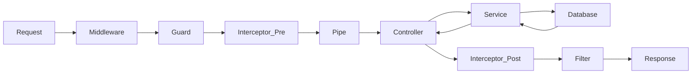

# NestJS Production Cheat Sheet

> **The ultimate guide to building scalable, production-ready backend systems with NestJS, Prisma, and PostgreSQL.**

---

## 1. Project Structure (Scalable Monolith)

Don't dump everything in `src`. Use a domain-driven feature module structure.

```text
src/
├── common/                  # Global utilities, filters, guards
│   ├── decorators/          # @CurrentUser(), @Public()
│   ├── filters/             # AllExceptionsFilter
│   ├── guards/              # JwtAuthGuard, RolesGuard
│   ├── interceptors/        # TransformInterceptor, LoggingInterceptor
│   └── pipes/               # ValidationPipe
├── config/                  # Configuration (Env validation)
├── modules/                 # Feature Modules (Domain logic)
│   ├── auth/                # Auth logic (JWT, Strategies)
│   ├── chat/                # Real-time chat (Gateway + Service)
│   ├── prisma/              # DB connection module
│   └── users/               # Users CRUD
├── app.module.ts            # Root module
└── main.ts                  # Entry point
```

---

## 2. Core Patterns: Modules, Controllers, Services

### The Module (`user.module.ts`)
Encapsulate feature logic. Always explicitly `export` services needed by other modules.
```typescript
@Module({
  imports: [PrismaModule],     // Import other modules needed
  controllers: [UserController],
  providers: [UserService],    // Providers internal to this module
  exports: [UserService],      // Expose Service to other modules
})
export class UserModule {}
```

### The Controller (`user.controller.ts`)
Handles HTTP requests. **Keep it thin.** Delegate business logic to the Service.
```typescript
@Controller('users')
@UseGuards(JwtAuthGuard)     // Protect entire controller
export class UserController {
  constructor(private readonly userService: UserService) {}

  @Get('profile')
  getProfile(@CurrentUser() user: UserPayload) {
    return this.userService.getUserProfile(user.id);
  }
}
```

### The Service (`user.service.ts`)
Contains business logic & DB interaction.
```typescript
@Injectable()
export class UserService {
  constructor(private prisma: PrismaService) {}

  async getUserProfile(id: string) {
    const user = await this.prisma.user.findUnique({ where: { id } });
    if (!user) throw new NotFoundException('User not found');
    return user;
  }
}
```

---

## 3. DTOs & Validation

Never use raw `any` types. Use DTOs with `class-validator`.

**Setup (main.ts):**
```typescript
app.useGlobalPipes(new ValidationPipe({
  whitelist: true,   // Strip properties not in DTO
  transform: true,   // Auto-transform payloads to DTO instances
  forbidNonWhitelisted: true, // Throw error on extra fields
}));
```

**DTO (`create-user.dto.ts`):**
```typescript
import { IsEmail, IsString, MinLength, IsOptional } from 'class-validator';

export class CreateUserDto {
  @IsEmail()
  email: string;

  @IsString()
  @MinLength(8)
  password: string;

  @IsString()
  @IsOptional()
  name?: string;
}
```

---

## 4. Guards, Pipes, Interceptors

- **Guards**: Authorization (Can they access this?).
- **Pipes**: Validation & Transformation (Is the data correct?).
- **Interceptors**: Response mapping / Logging (Transform the result).

### Custom Param Decorator (`current-user.decorator.ts`)
Extract user from Request object (populated by Passport).
```typescript
import { createParamDecorator, ExecutionContext } from '@nestjs/common';

export const CurrentUser = createParamDecorator(
  (data: unknown, ctx: ExecutionContext) => {
    const request = ctx.switchToHttp().getRequest();
    return request.user;
  },
);
```

---

## 5. Middleware

Runs *before* guards. Use for logging request IPs or specialized header checks.

```typescript
// logger.middleware.ts
@Injectable()
export class LoggerMiddleware implements NestMiddleware {
  use(req: Request, res: Response, next: NextFunction) {
    console.log(`Request... ${req.method} ${req.path}`);
    next();
  }
}

// app.module.ts
export class AppModule implements NestModule {
  configure(consumer: MiddlewareConsumer) {
    consumer.apply(LoggerMiddleware).forRoutes('*');
  }
}
```

---

## 6. Authentication (JWT + Refresh Token)

**Strategy:** Access Token (15m, short storage) + Refresh Token (7d, DB storage).

**Auth Service (`login`):**
```typescript
async login(user: User) {
  const payload = { sub: user.id, email: user.email };
  return {
    accessToken: this.jwtService.sign(payload, { expiresIn: '15m' }),
    refreshToken: this.jwtService.sign(payload, { expiresIn: '7d' }),
  };
}
```
**JWT Strategy (`jwt.strategy.ts`):**
```typescript
@Injectable()
export class JwtStrategy extends PassportStrategy(Strategy) {
  constructor(config: ConfigService) {
    super({
      jwtFromRequest: ExtractJwt.fromAuthHeaderAsBearerToken(),
      secretOrKey: config.get('JWT_SECRET'),
    });
  }

  async validate(payload: any) {
    // This return value is injected into @CurrentUser
    return { id: payload.sub, email: payload.email }; 
  }
}
```

---

## 7. Role-Based Access Control (RBAC)

**Enum:**
```typescript
export enum Role {
  USER = 'USER',
  ADMIN = 'ADMIN',
}
```

**Decorator (`roles.decorator.ts`):**
```typescript
import { SetMetadata } from '@nestjs/common';
export const Roles = (...roles: Role[]) => SetMetadata('roles', roles);
```

**Guard (`roles.guard.ts`):**
```typescript
@Injectable()
export class RolesGuard implements CanActivate {
  constructor(private reflector: Reflector) {}

  canActivate(context: ExecutionContext): boolean {
    const requiredRoles = this.reflector.getAllAndOverride<Role[]>('roles', [
      context.getHandler(),
      context.getClass(),
    ]);
    if (!requiredRoles) return true;
    
    const { user } = context.switchToHttp().getRequest();
    return requiredRoles.some((role) => user.role === role);
  }
}
```

**Usage:**
```typescript
@Authorize() // Custom composite decorator
@Roles(Role.ADMIN)
@Delete(':id')
remove(@Param('id') id: string) { ... }
```

---

## 8. Prisma Integration (Production)

Don't use `new PrismaClient()` everywhere. Use a singleton service.

```typescript
// prisma.service.ts
@Injectable()
export class PrismaService extends PrismaClient implements OnModuleInit, OnModuleDestroy {
  async onModuleInit() {
    await this.$connect();
  }
  async onModuleDestroy() {
    await this.$disconnect();
  }
}

// Global Module
@Global()
@Module({
  providers: [PrismaService],
  exports: [PrismaService],
})
export class PrismaModule {}
```

---

## 9. WebSockets (Gateways)

For Real-Time Chat.

```typescript
@WebSocketGateway({ cors: { origin: '*' } })
export class ChatGateway implements OnGatewayConnection, OnGatewayDisconnect {
  @WebSocketServer()
  server: Server;

  handleConnection(client: Socket) {
    // Verify token from query or headers here
    console.log(`Client connected: ${client.id}`);
  }

  @SubscribeMessage('sendMessage')
  handleMessage(@MessageBody() data: any, @ConnectedSocket() client: Socket) {
    this.server.to(data.roomId).emit('newMessage', data);
  }
}
```

---

## 10. Error Handling Best Practices

Process all errors in one place.

**Global Filter (`all-exceptions.filter.ts`):**
```typescript
@Catch()
export class AllExceptionsFilter implements ExceptionFilter {
  catch(exception: unknown, host: ArgumentsHost) {
    const ctx = host.switchToHttp();
    const response = ctx.getResponse<Response>();
    const status = exception instanceof HttpException 
      ? exception.getStatus() 
      : HttpStatus.INTERNAL_SERVER_ERROR;

    response.status(status).json({
      statusCode: status,
      timestamp: new Date().toISOString(),
      path: ctx.getRequest().url,
      message: exception['message'] || 'Internal server error',
    });
  }
}
```

---

## 11. Environment Variables

Use `@nestjs/config`.

1. Install: `npm i @nestjs/config`
2. Configure in `app.module.ts`:
```typescript
ConfigModule.forRoot({
  isGlobal: true,  // No need to import ConfigModule elsewhere
  envFilePath: '.env',
})
```
3. Usage:
```typescript
constructor(private config: ConfigService) {}
const dbUrl = this.config.get<string>('DATABASE_URL');
```

---

## 12. Diagrams

### NestJS Request Flow


---

## 13. Final Checklist: Production Ready

### Modules & Architecture
- [ ] Feature modules created (Auth, User, Chat).
- [ ] `PrismaModule` is Global.
- [ ] Controllers are thin errors thrown in Service.

### Auth & Security
- [ ] JWT expiration short (15m), Refresh Token long (7d).
- [ ] Passwords hashed with bcrypt/argon2.
- [ ] CORS configured (`{ origin: 'https://mydomain.com', credentials: true }`).
- [ ] Helmet is enabled (`app.use(helmet())`).

### Validation & Error Handling
- [ ] `ValidationPipe` enabled strictly with `whitelist: true`.
- [ ] Global Exception Filter overrides default HTML errors.
- [ ] Environment variables validated (App shouldn't start without DATABASE_URL).

### Real-Time
- [ ] WebSocket Gateway protected by Auth Guard (Verify token on handshake).
- [ ] Redis Adapter used for Socket.io (if scaling > 1 node).
