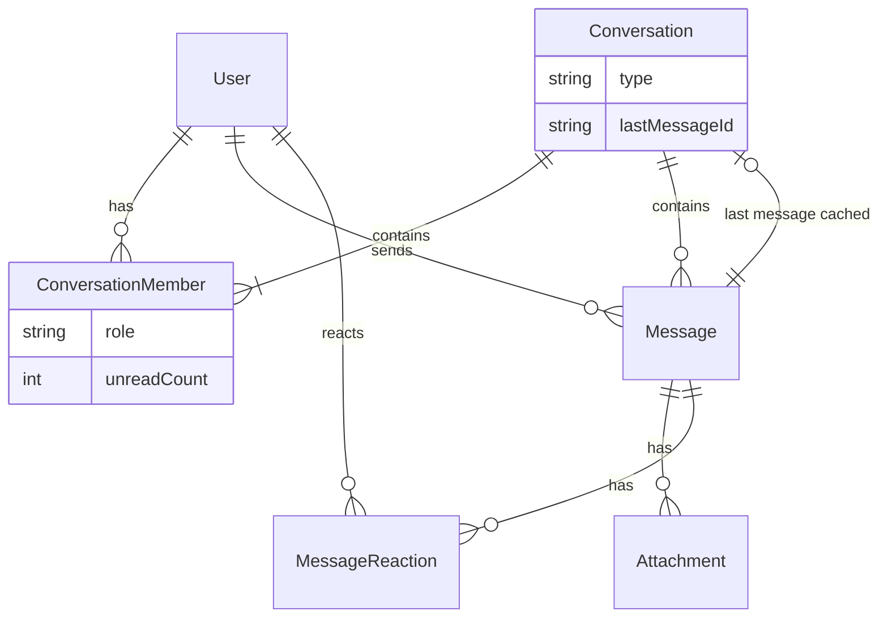
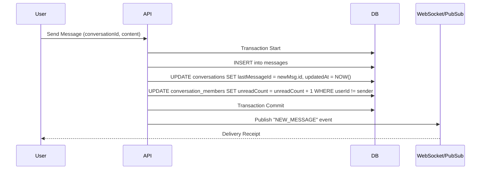

# Schema Design Master Guide: Scalable Real-Time Chat System

> **A definitive guide for backend architects designed to scale to 1M+ users and 500M+ messages.**

---

## Table of Contents
1. [Entity Discovery & Relationship Mapping](#1-entity-discovery--relationship-mapping)
2. [Prisma Schema (Production & Scalable)](#2-prisma-schema-production-version)
3. [PostgreSQL SQL DDL](#3-equivalent-postgresql-sql-ddl)
4. [Architecture Diagrams](#4-diagrams)
5. [Query Performance Design](#5-query-design)
6. [Scalability & Optimization Decisions](#6-scalability-design-decisions)
7. [Production Migration Strategy](#7-production-migration-strategy)
8. [Architect's Checklist](#8-final-checklist)

---

## 1. Entity Discovery & Relationship Mapping

In a modern chat system (like WhatsApp, Slack, or Discord), data is highly relational but requires key denormalization for read performance.

### Core Entities

#### 1. **User**
- **Represents:** A unique identity in the system.
- **Fields:** `id`, `email`, `username`, `passwordHash`, `lastActiveAt`, `isOnline` (optional, often Redis).
- **Relationships:**
  - 1:N with `ConversationMember` (User belongs to many chats)
  - 1:N with `Message` (User sends many messages)
  - 1:1 with `UserSettings`

#### 2. **Conversation**
- **Represents:** A container for messages. Can be a Direct Message (DM) or a Group.
- **Fields:** `id`, `type` (DM, GROUP), `title` (group name), `description`, `lastMessageId` (Caching), `updatedAt` (Sorting).
- **Why `lastMessageId`?** Sorting the conversation list by "most recent activity" is the #1 most frequent query. Joining the Message table to find the max(created_at) for every conversation is too slow at scale.
- **Relationships:**
  - 1:N with `ConversationMember`
  - 1:N with `Message`

#### 3. **ConversationMember** (The Join Table)
- **Represents:** The link between a User and a Conversation.
- **Fields:** `id`, `userId`, `conversationId`, `role` (ADMIN, MEMBER), `unreadCount`.
- **Why Explicit?** We need to store metadata *per user per chat* (e.g., unread counts, muted status, role). A simple implicit `_UserToConversation` table is insufficient.
- **Relationships:**
  - N:1 with `User`
  - N:1 with `Conversation`

#### 4. **Message**
- **Represents:** A single unit of communication.
- **Fields:** `id`, `content`, `type` (TEXT, IMAGE, VIDEO, SYSTEM), `senderId`, `conversationId`, `replyToId`.
- **Relationships:**
  - N:1 with `Conversation`
  - N:1 with `User` (Sender)
  - 1:N with `Attachment`
  - 1:N with `MessageReaction`

#### 5. **Attachment**
- **Represents:** Media files associated with a message.
- **Fields:** `id`, `url`, `type`, `size`, `messageId`.
- **Reasoning:** Separating attachments allows a message to have multiple files without bloating the Message table or using unstructured JSON arrays.

---

## 2. Prisma Schema (Production Version)

This schema uses **CUIDs** for IDs to ensure globally unique, sortable, and scalable identifiers (better than UUIDs for DB indexing).

```prisma
datasource db {
  provider = "postgresql"
  url      = env("DATABASE_URL")
}

generator client {
  provider = "prisma-client-js"
}

// --------------------------------------
// Enums
// --------------------------------------

enum ConversationType {
  DM
  GROUP
}

enum MemberRole {
  MEMBER
  ADMIN
  MODERATOR
}

enum MessageType {
  TEXT
  IMAGE
  VIDEO
  FILE
  SYSTEM // For "User created the group", "User left" etc.
}

// --------------------------------------
// Models
// --------------------------------------

model User {
  id              String   @id @default(cuid())
  email           String   @unique
  username        String   @unique
  passwordHash    String
  avatarUrl       String?
  bio             String?
  
  // Timestamps
  createdAt       DateTime @default(now())
  lastActiveAt    DateTime @default(now())

  // Relations
  conversations   ConversationMember[]
  messages        Message[]
  reactions       MessageReaction[]
  settings        UserSettings?

  @@map("users")
  @@index([email, username])
}

model UserSettings {
  id              String  @id @default(cuid())
  userId          String  @unique
  theme           String  @default("light") // light, dark, system
  notifications   Boolean @default(true)
  
  user            User    @relation(fields: [userId], references: [id], onDelete: Cascade)

  @@map("user_settings")
}

model Conversation {
  id              String           @id @default(cuid())
  type            ConversationType @default(DM)
  title           String?          // Nullable for DMs
  description     String?
  
  // Denormalization for Performance
  lastMessageId   String?          @unique // Unique mainly to allow relation, but logically one-to-one pointer
  
  // Timestamps
  createdAt       DateTime         @default(now())
  updatedAt       DateTime         @updatedAt // CRITICAL: Used to sort user's chat list

  // Relations
  messages        Message[]        @relation("ConversationMessages")
  members         ConversationMember[]
  lastMessage     Message?         @relation("LastMessage", fields: [lastMessageId], references: [id])

  @@map("conversations")
  @@index([updatedAt]) // Critical for sorting feeds
}

model ConversationMember {
  id              String     @id @default(cuid())
  conversationId  String
  userId          String
  role            MemberRole @default(MEMBER)
  
  // State
  joinedAt        DateTime   @default(now())
  lastReadAt      DateTime   @default(now())
  unreadCount     Int        @default(0) // Optimistic UI counter

  // Relations
  conversation    Conversation @relation(fields: [conversationId], references: [id], onDelete: Cascade)
  user            User         @relation(fields: [userId], references: [id], onDelete: Cascade)

  @@unique([conversationId, userId]) // Compound primary key equivalent
  @@map("conversation_members")
  @@index([userId, unreadCount]) // Efficiently fetch total unread for a user
}

model Message {
  id              String      @id @default(cuid())
  content         String      @db.Text
  type            MessageType @default(TEXT)
  
  conversationId  String
  senderId        String
  
  createdAt       DateTime    @default(now())
  updatedAt       DateTime    @updatedAt
  isDeleted       Boolean     @default(false)

  // Relations
  conversation    Conversation @relation("ConversationMessages", fields: [conversationId], references: [id], onDelete: Cascade)
  sender          User         @relation(fields: [senderId], references: [id])
  attachments     Attachment[]
  reactions       MessageReaction[]

  // References relation for caching (opposite side)
  isLastMessageFor Conversation? @relation("LastMessage")

  @@map("messages")
  @@index([conversationId, createdAt(sort: Desc)]) // Determining specific chat history
}

model Attachment {
  id              String   @id @default(cuid())
  messageId       String
  url             String
  fileType        String
  size            Int      // bytes
  createdAt       DateTime @default(now())

  message         Message  @relation(fields: [messageId], references: [id], onDelete: Cascade)

  @@map("attachments")
}

model MessageReaction {
  id              String   @id @default(cuid())
  messageId       String
  userId          String
  emoji           String

  message         Message  @relation(fields: [messageId], references: [id], onDelete: Cascade)
  user            User     @relation(fields: [userId], references: [id], onDelete: Cascade)

  @@unique([messageId, userId, emoji]) // User cannot react with same emoji twice
  @@map("message_reactions")
}
```

---

## 3. Equivalent PostgreSQL SQL DDL

Optimized for PostgreSQL 14+, utilizing proper indexing and constraints.

```sql
-- 1. ENUMS
CREATE TYPE "ConversationType" AS ENUM ('DM', 'GROUP');
CREATE TYPE "MemberRole" AS ENUM ('MEMBER', 'ADMIN', 'MODERATOR');
CREATE TYPE "MessageType" AS ENUM ('TEXT', 'IMAGE', 'VIDEO', 'FILE', 'SYSTEM');

-- 2. USERS
CREATE TABLE "users" (
    "id" TEXT NOT NULL,
    "email" TEXT NOT NULL,
    "username" TEXT NOT NULL,
    "passwordHash" TEXT NOT NULL,
    "avatarUrl" TEXT,
    "bio" TEXT,
    "createdAt" TIMESTAMP(3) NOT NULL DEFAULT CURRENT_TIMESTAMP,
    "lastActiveAt" TIMESTAMP(3) NOT NULL DEFAULT CURRENT_TIMESTAMP,
    CONSTRAINT "users_pkey" PRIMARY KEY ("id")
);
CREATE UNIQUE INDEX "users_email_key" ON "users"("email");
CREATE UNIQUE INDEX "users_username_key" ON "users"("username");

-- 3. CONVERSATIONS
CREATE TABLE "conversations" (
    "id" TEXT NOT NULL,
    "type" "ConversationType" NOT NULL DEFAULT 'DM',
    "title" TEXT,
    "description" TEXT,
    "lastMessageId" TEXT,
    "createdAt" TIMESTAMP(3) NOT NULL DEFAULT CURRENT_TIMESTAMP,
    "updatedAt" TIMESTAMP(3) NOT NULL,
    CONSTRAINT "conversations_pkey" PRIMARY KEY ("id")
);
CREATE UNIQUE INDEX "conversations_lastMessageId_key" ON "conversations"("lastMessageId");
CREATE INDEX "conversations_updatedAt_idx" ON "conversations"("updatedAt");

-- 4. CONVERSATION MEMBERS
CREATE TABLE "conversation_members" (
    "id" TEXT NOT NULL,
    "conversationId" TEXT NOT NULL,
    "userId" TEXT NOT NULL,
    "role" "MemberRole" NOT NULL DEFAULT 'MEMBER',
    "joinedAt" TIMESTAMP(3) NOT NULL DEFAULT CURRENT_TIMESTAMP,
    "lastReadAt" TIMESTAMP(3) NOT NULL DEFAULT CURRENT_TIMESTAMP,
    "unreadCount" INTEGER NOT NULL DEFAULT 0,
    CONSTRAINT "conversation_members_pkey" PRIMARY KEY ("id")
);
CREATE UNIQUE INDEX "conversation_members_conversationId_userId_key" ON "conversation_members"("conversationId", "userId");
-- Foreign Keys
ALTER TABLE "conversation_members" ADD CONSTRAINT "conversation_members_conversationId_fkey" FOREIGN KEY ("conversationId") REFERENCES "conversations"("id") ON DELETE CASCADE ON UPDATE CASCADE;
ALTER TABLE "conversation_members" ADD CONSTRAINT "conversation_members_userId_fkey" FOREIGN KEY ("userId") REFERENCES "users"("id") ON DELETE CASCADE ON UPDATE CASCADE;

-- 5. MESSAGES
CREATE TABLE "messages" (
    "id" TEXT NOT NULL,
    "content" TEXT NOT NULL,
    "type" "MessageType" NOT NULL DEFAULT 'TEXT',
    "conversationId" TEXT NOT NULL,
    "senderId" TEXT NOT NULL,
    "createdAt" TIMESTAMP(3) NOT NULL DEFAULT CURRENT_TIMESTAMP,
    "updatedAt" TIMESTAMP(3) NOT NULL,
    "isDeleted" BOOLEAN NOT NULL DEFAULT false,
    CONSTRAINT "messages_pkey" PRIMARY KEY ("id")
);
-- Composite Index for Cursor Pagination: (conversationId + createdAt)
CREATE INDEX "messages_conversationId_createdAt_idx" ON "messages"("conversationId", "createdAt" DESC);
ALTER TABLE "messages" ADD CONSTRAINT "messages_conversationId_fkey" FOREIGN KEY ("conversationId") REFERENCES "conversations"("id") ON DELETE CASCADE ON UPDATE CASCADE;
ALTER TABLE "messages" ADD CONSTRAINT "messages_senderId_fkey" FOREIGN KEY ("senderId") REFERENCES "users"("id") ON DELETE RESTRICT ON UPDATE CASCADE;

-- Add cyclic FK for conversations (lastMessage) AFTER table creation to avoid errors
ALTER TABLE "conversations" ADD CONSTRAINT "conversations_lastMessageId_fkey" FOREIGN KEY ("lastMessageId") REFERENCES "messages"("id") ON DELETE SET NULL ON UPDATE CASCADE;
```

---

## 4. Diagrams

### ER Diagram (Entity Relationships)


### Flow: Sending a Message & Update Cache


---

## 5. Query Design

### 1. Create Private DM (Idempotent)
Check if a DM exists between two users before creating.
```typescript
async function createOrGetDM(userA: string, userB: string) {
  // Check if they already have a logical DM
  // This usually requires a complex query on the Join Table or a specific 'hash' key
  // Easier approach: Use findFirst with existing members
  
  const existing = await prisma.conversation.findFirst({
    where: {
      type: 'DM',
      AND: [
        { members: { some: { userId: userA } } },
        { members: { some: { userId: userB } } }
      ]
    }
  });

  if (existing) return existing;

  return prisma.conversation.create({
    data: {
      type: 'DM',
      members: {
        create: [
          { userId: userA, role: 'ADMIN' },
          { userId: userB, role: 'ADMIN' }
        ]
      }
    }
  });
}
```

### 2. Fetch User's Conversation List (The "Mega Query")
Optimized for the sidebar. Fetches chat info, the last message, and the unread count for *this* user.
```typescript
const userId = "current-user-id";
const chats = await prisma.conversation.findMany({
  where: {
    members: { some: { userId } }
  },
  take: 20,
  orderBy: { updatedAt: 'desc' }, // Critical optimization using cached timestamp
  include: {
    // 1. Get the last message details for preview
    lastMessage: {
      select: {
        content: true,
        type: true,
        createdAt: true,
        senderId: true
      }
    },
    // 2. Get unread count specifically for THIS user
    members: {
      where: { userId },
      select: { unreadCount: true }
    },
    // 3. (Optional) Get other members for avatars in DM
    members: {
      take: 4,
      include: { user: { select: { username: true, avatarUrl: true } } }
    }
  }
});
```

### 3. Fetch Messages with Cursor Pagination
Never use `offset` / `skip` for chat histories. It kills performance on large tables. Use `cursor`.
```typescript
const messages = await prisma.message.findMany({
  where: { conversationId: "chat-id" },
  take: 50,
  skip: 1, // Skip the cursor itself
  cursor: { id: "last-seen-message-id" },
  orderBy: { createdAt: 'desc' },
  include: {
    sender: { select: { id: true, username: true, avatarUrl: true } },
    attachments: true
  }
});
```

---

## 6. Scalability Design Decisions

### 1. Caching `lastMessageId` and `updatedAt` on Conversation
**Why?** The "My Chats" screen is the most loaded view. Without this cache, for every chat in the list (e.g., 50 chats), the DB has to:
1. Join the Messages table.
2. Sort all messages by date.
3. Pick the top one.
For 1M users, this aggregate query brings the DB to its knees.
**Solution:** Denormalize. When a message is sent, update the `Conversation` parent row. It turns an O(N) operation into O(1) read.

### 2. Explicit `ConversationMember` Unread Counts
**Why?** Calculating `COUNT(*)` of messages where `createdAt > user.lastViewed` for every chat on every refresh is expensive.
**Solution:** Atomic increments. When sending a message, increment `unreadCount` for all other members. When a user opens the chat, reset `unreadCount` to 0.

### 3. Indexing `[conversationId, createdAt DESC]`
**Why?** Messages are almost always queried by conversation, latest first. A composite index allows the DB to jump exactly to the specific chat's storage block and read sequentially.

### 4. Why M:N (Many-to-Many) via Explicit Table?
Prisma supports implicit M:N (`User` <-> `Conversation`), but it hides the join table. In a real app, the *relationship itself* has data:
- `role` (Is this user an Admin?)
- `joinedAt` (Did they join after the message was sent?)
- `unreadCount`
You **cannot** do this with implicit arrays. You must define `ConversationMember`.

---

## 7. Production Migration Strategy

### Phase 1: Initial Deployment
1. Deploy schema with empty tables.
2. Ensure constraints (Foreign Keys) are active.

### Phase 2: Adding Denormalization to Existing System
If you already have data but want to add `lastMessageId`:
1. Add column `lastMessageId` (nullable).
2. Create a migration script:
   ```sql
   UPDATE conversations c
   SET "lastMessageId" = (
       SELECT id FROM messages m 
       WHERE m."conversationId" = c.id 
       ORDER BY "createdAt" DESC 
       LIMIT 1
   );
   ```
3. Make column non-nullable (if desired) or strict in code.

### Phase 3: Zero-Downtime Deployment
1. **Expand**: Add new columns/tables in DB. Deploy code that *writes* to both old and new columns but *reads* from old.
2. **Migrate**: Run background worker to backfill data to new columns.
3. **Contract**: Deploy code that reads from new columns. Remove writes to old columns.
4. **Cleanup**: Drop old columns.

---

## 8. Final Checklist

Before shipping, verify:

- [ ] **Indexes**: Do all Foreign Keys have indexes? (Prisma does NOT add them automatically to relations).
- [ ] **Sorting**: Is `conversation.updatedAt` indexed? (Crucial for list views).
- [ ] **Types**: Are you using `String` (CUID/UUID) for IDs? Ints expose business volume and are harder to merge/shard.
- [ ] **Cascades**: Does deleting a `Conversation` cascade delete `Messages` and `Members`? (Prevents orphan data).
- [ ] **JSON**: Are you using `Json` types for rarely queried settings instead of new tables?
- [ ] **N+1**: Have you verified your API doesn't make a DB call per message in a loop? (Use `include` or `dataloaders`).

> **Architect's Maxim:** "Reads are frequent, writes are expensive. Optimize your schema for the read patterns (Denormalization), not just for storage purity (Normalization)."
