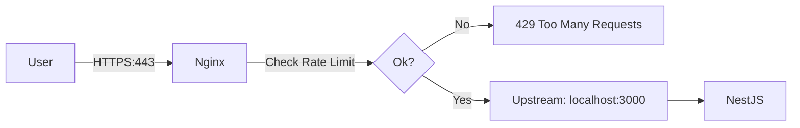
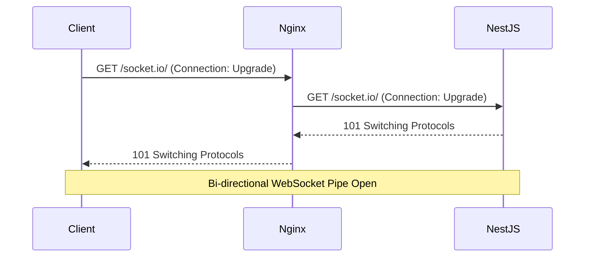

# Nginx Production Cheat Sheet

> **The ultimate reference for Reverse Proxying, Load Balancing, and Securing NestJS Applications.**

---

## 1. Basic Structure

Nginx config is usually at `/etc/nginx/nginx.conf` or sites at `/etc/nginx/sites-available/default`.

```nginx
user www-data;
worker_processes auto; # Scale to CPU cores
pid /run/nginx.pid;

events {
    worker_connections 1024;
}

http {
    include /etc/nginx/mime.types;
    access_log /var/log/nginx/access.log;
    error_log /var/log/nginx/error.log;

    # Includes virtual host configs
    include /etc/nginx/conf.d/*.conf;
    include /etc/nginx/sites-enabled/*;
}
```

---

## 2. Reverse Proxy (NestJS)

Forward port 80/443 traffic to your Node app running on port 3000.

`/etc/nginx/sites-available/myapp`:
```nginx
server {
    listen 80;
    server_name api.example.com;

    location / {
        proxy_pass http://localhost:3000; # Forward to NestJS
        proxy_http_version 1.1;
        proxy_set_header Upgrade $http_upgrade;
        proxy_set_header Connection 'upgrade';
        proxy_set_header Host $host;
        proxy_cache_bypass $http_upgrade;
        
        # Pass real IP to NestJS
        proxy_set_header X-Real-IP $remote_addr;
        proxy_set_header X-Forwarded-For $proxy_add_x_forwarded_for;
    }
}
```

---

## 3. SSL / HTTPS (Let's Encrypt)

Don't configure SSL manually. Use `certbot`.

1. **Install**:
   ```bash
   sudo apt install certbot python3-certbot-nginx
   ```
2. **Run**:
   ```bash
   sudo certbot --nginx -d api.example.com
   ```
   Certbot automatically modifies your Nginx config to add listeners on 443 and SSL paths.

---

## 4. Load Balancing

Distribute traffic across multiple NestJS instances (e.g., Docker replicas).

```nginx
upstream nestjs_backend {
    # Round Robin (default)
    server localhost:3000;
    server localhost:3001;
    server localhost:3002;
    
    # Or strict sticky sessions (if needed)
    # ip_hash;
}

server {
    listen 80;
    server_name api.example.com;

    location / {
        proxy_pass http://nestjs_backend;
    }
}
```

---

## 5. Security Hardening

Add these headers to prevent common attacks (XSS, Clickjacking).

```nginx
server {
    # ... existing config ...

    # Hide Nginx version
    server_tokens off;

    # Security Headers
    add_header X-Frame-Options "SAMEORIGIN";
    add_header X-XSS-Protection "1; mode=block";
    add_header X-Content-Type-Options "nosniff";
    
    # Block specific file access
    location ~ /\. {
        deny all;
    }
}
```

---

## 6. Rate Limiting (DDOS Protection)

Protect your API from abuse.

```nginx
http {
    # Define limit: 10 requests per second per IP
    limit_req_zone $binary_remote_addr zone=mylimit:10m rate=10r/s;

    server {
        location /api/ {
            # Apply limit
            limit_req zone=mylimit burst=20 nodelay;
            
            proxy_pass http://localhost:3000;
        }
    }
}
```

---

## 7. WebSocket Passthrough

NestJS Gateways (Socket.io) require specific headers.

```nginx
location /socket.io/ {
    proxy_pass http://localhost:3000;
    
    proxy_http_version 1.1;
    proxy_set_header Upgrade $http_upgrade;
    proxy_set_header Connection "upgrade";
    
    proxy_set_header Host $host;
}
```

---

## 8. Essential Commands

```bash
# Test configuration syntax (CRITICAL before restart)
sudo nginx -t

# Reload config without downtime
sudo systemctl reload nginx

# Restart service
sudo systemctl restart nginx

# View logs
tail -f /var/log/nginx/error.log
```

---

## 9. Diagrams

### Proxy Flow


### WebSocket Upgrade


---

## 10. Final Checklist: Nginx

### Setup
- [ ] `client_max_body_size` increased (e.g., `10M` for file uploads).
- [ ] `server_tokens off;` enabled.
- [ ] Configuration tested with `nginx -t`.

### SSL
- [ ] HTTP (80) redirects to HTTPS (443).
- [ ] Certbot auto-renewal is active (`systemctl status certbot.timer`).

### Performance
- [ ] Gzip compression enabled (`gzip on;`).
- [ ] Static assets cached (if Nginx serves specific folders).
- [ ] Worker processes set to `auto`.

---

## Example Full Config (Production)

```nginx
server {
    listen 80;
    server_name api.example.com;
    return 301 https://$host$request_uri; # Force HTTPS
}

server {
    listen 443 ssl http2;
    server_name api.example.com;

    ssl_certificate /etc/letsencrypt/live/api.example.com/fullchain.pem;
    ssl_certificate_key /etc/letsencrypt/live/api.example.com/privkey.pem;

    # Performance
    gzip on;
    gzip_types text/plain application/json;
    client_max_body_size 20M;

    location / {
        proxy_pass http://localhost:3000;
        proxy_http_version 1.1;
        proxy_set_header Upgrade $http_upgrade;
        proxy_set_header Connection 'upgrade';
        proxy_set_header Host $host;
        proxy_cache_bypass $http_upgrade;
    }
}
```
