# Hi there, I'm Manish Keer 👋

## 🚀 Full Stack & Android Developer | Building Digital Experiences

> _"Transforming ideas into scalable, real-time applications with modern tech stacks"_

Welcome to my GitHub profile! I'm a passionate developer specializing in full-stack web development and mobile app creation. I love building real-time applications that solve real-world problems and deliver exceptional user experiences.

## 👨‍💻 Professional Summary

Full-Stack and Android Developer experienced in building scalable web and mobile applications. Strong in REST APIs, WebSockets, React Native, authentication systems, Docker, CI/CD pipelines, and AWS cloud deployments.

---

## � Experience

**Full-Stack & Android Developer** | _Inspire Transoft Pvt Ltd, India_
_(Oct 2025 – Present)_

- Developing scalable full-stack web applications using modern JavaScript and TypeScript stacks.
- Building Android applications using React Native with API integrations and state management.
- Designed CI/CD pipelines and automated zero-downtime deployments.
- Dockerized services and managed AWS cloud infrastructure.
- Configured Nginx reverse proxy and handled production server environments.

**Full-Stack Developer Trainee** | _Singaji Software Solutions, Bengaluru, India_
_(Aug 2025 – Oct 2025)_

- Built backend REST APIs with authentication and database integrations.
- Collaborated with frontend teams to deliver optimized production features.

---

## 🎓 Education

**Medi-Caps University** | _Indore, India_

- **BCA** (Bachelor of Computer Applications) — CGPA: 7.7/10 _(Aug 2022 – May 2025)_

---

## �🛠️ Tech Stack

### Frontend

### Backend

### Database

### Tools & Platforms

---

## 🌟 Featured Projects

### 🎓 Shell E-Learning Academy

**Production-Ready LMS Platform**

- **Tech Stack:** MERN Stack, AWS, Docker, Nginx
- **Features:** Role-based dashboards, JWT authentication
- **Highlights:** Dockerized services, deployed on AWS with Nginx reverse proxy
- 🔗 [Live Demo](https://shellelearningacademy.com)

**Screenshots:**
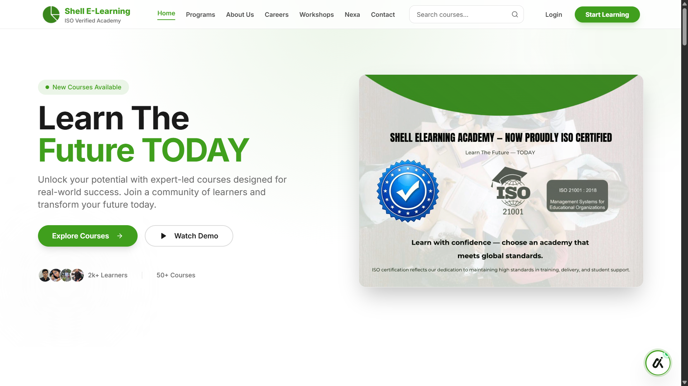
_Production-ready LMS platform interface_

### 🎥 Real-Time Communication Platform

**Low-latency Messaging and Calling System**

- **Tech Stack:** NestJS, WebRTC, PostgreSQL, WebSocket, Docker
- **Features:** Presence, video calling support, low-latency messaging
- **Highlights:** Implemented WebSocket signaling and scalable Docker deployment
- 🔗 [Live Demo](https://nest-chat-frontend.vercel.app/)

**Screenshots:**
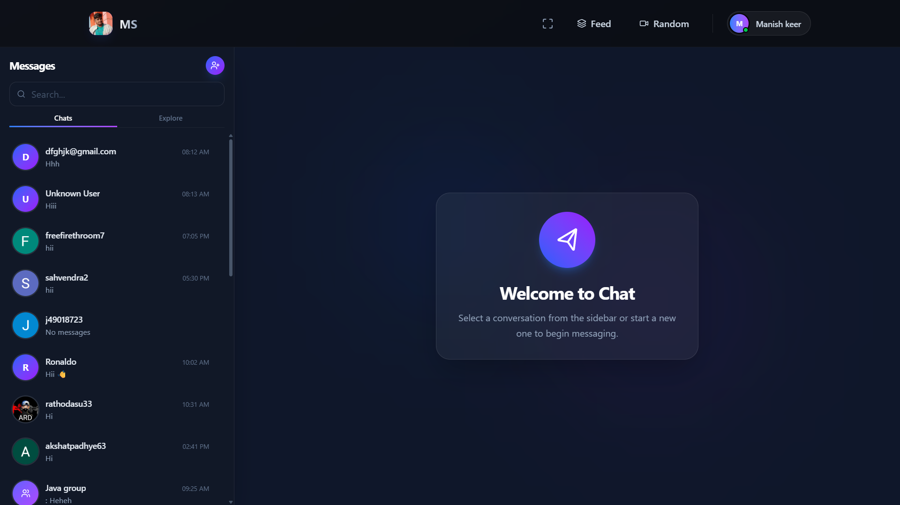
_Real-time messaging and video calling interface_

### 🎲 Betting Platform

**Real-time Gaming Platform**

- **Tech Stack:** Node.js, React, WebSocket, MongoDB
- **Features:** Concurrent real-time betting system, live odds updates, wallet system
- **Highlights:** Scalable WebSocket architecture for multi-user support, secure payment processing
- 🔗 [Live Demo](https://manish-bet-app.vercel.app) | [Source Code](https://github.com/Manish-keer19/Betting_App_Frontend)

**Screenshots:**
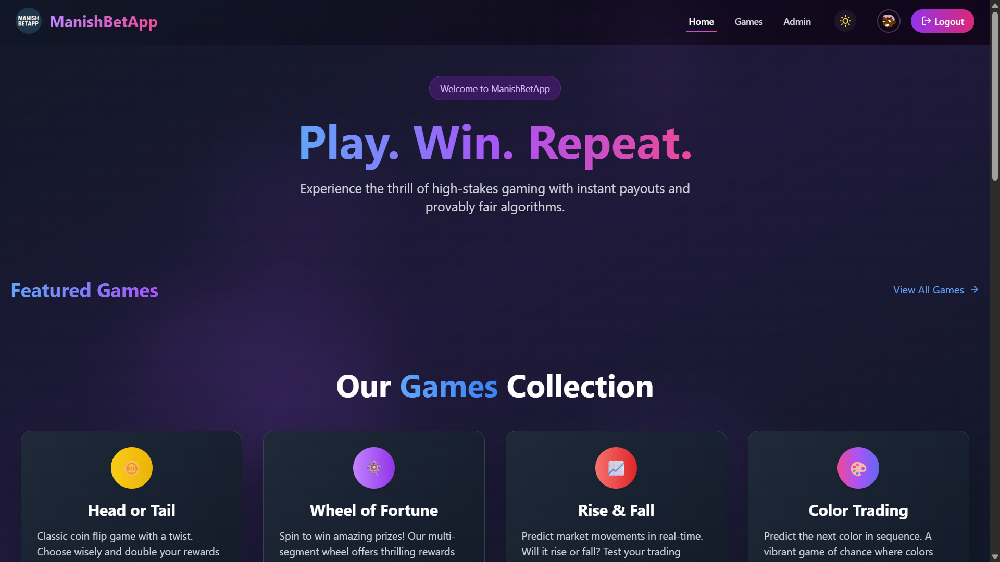
_Home page interface of Betting Platform_

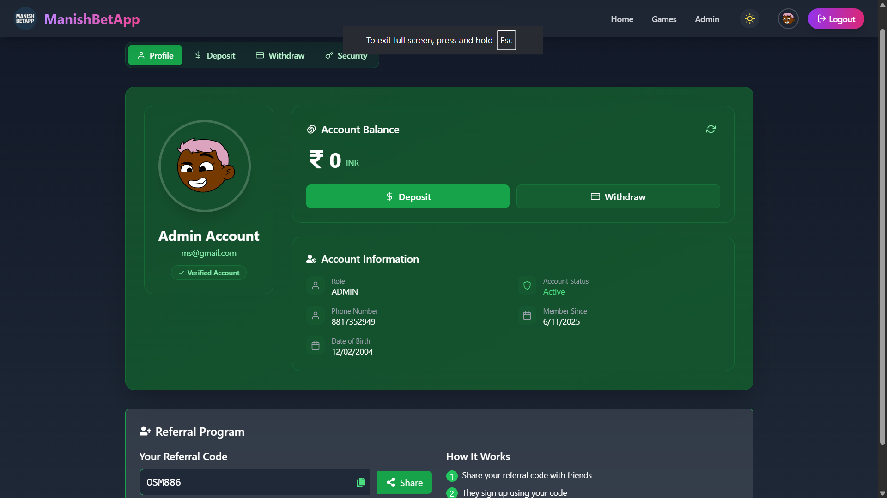
_User wallet with transaction history_

### 📱 InstaClone

**Social Media Mobile Application**

- **Tech Stack:** React Native CLI, Node.js, MongoDB
- **Features:** Photo sharing, stories, real-time feed, user profiles
- **Highlights:** Native mobile experience, camera integration, social interactions
- 🔗 [Source Code](https://github.com/Manish-keer19/Full_Stack-InstaClone-apk)

**Screenshots:**

_Social media feed with posts and interactions_

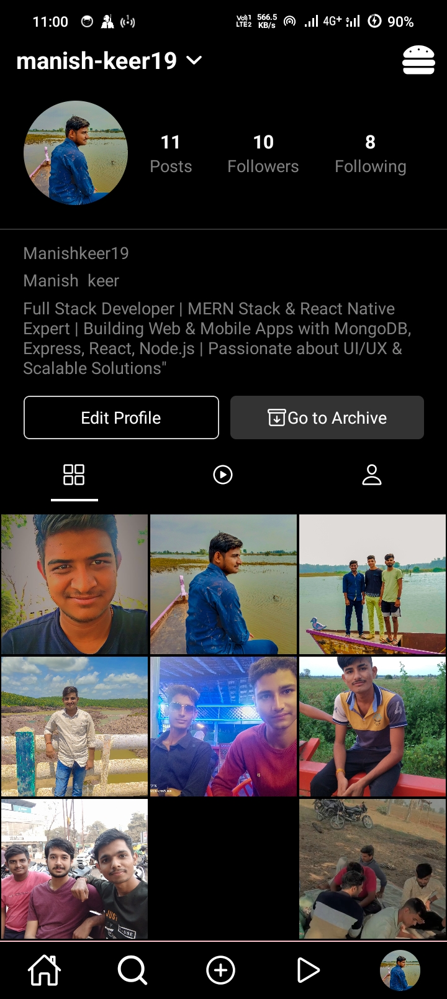
_User profile screen with posts grid_

### 💬 ChatWebApplication

**Real-time Messaging Platform**

- **Tech Stack:** MERN Stack, Socket.io, JWT, OAuth
- **Features:** Real-time messaging, Google/GitHub authentication, media sharing, group chats
- **Highlights:** Secure JWT authentication, real-time notifications, responsive design
- 🔗 [Live Demo](https://manishchatapp.vercel.app) | [Source Code](https://github.com/Manish-keer19/chat-web-app)

**Screenshots:**
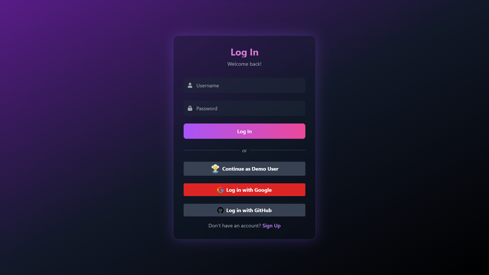
_Login screen with OAuth integration_

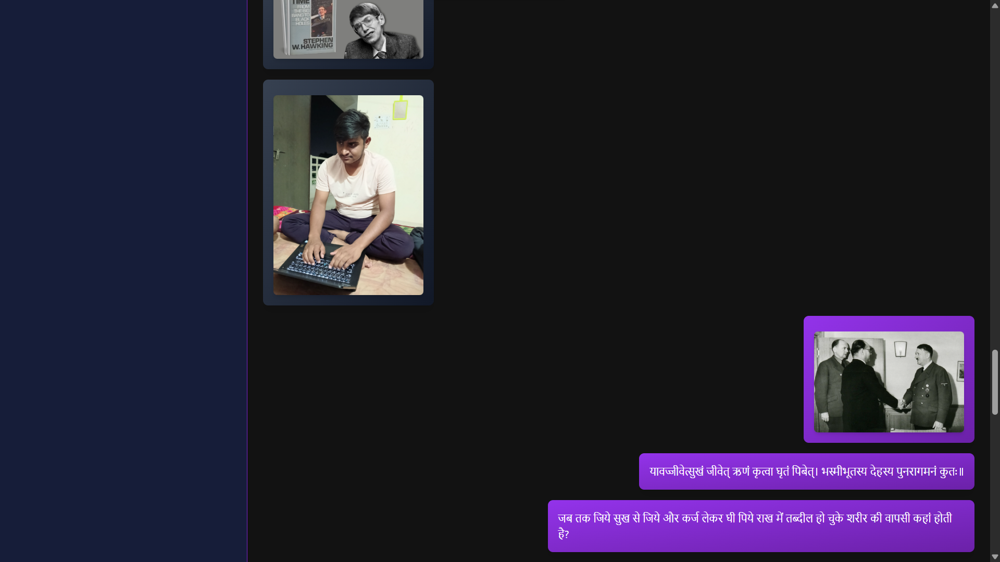
_Main chat interface with real-time messaging_

### 📱 Android Chat App

**Native Mobile Messaging Application**

- **Tech Stack:** React Native CLI, Spring Boot, MongoDB, WebSocket, JWT, OAuth2 (Google/GitHub)
- **Features:** Real-time messaging, OAuth login, media sharing, push notifications, user presence, offline sync, dark/light mode
- **Highlights:** Native Android performance, secure backend, material design UI
- 🔗 [APK Download](https://www.mediafire.com/file/7acyxs5grs88v25/ManishChatApp.apk/file) | [Source Code](https://github.com/Manish-keer19/chatAndroidApp)

**Screenshots:**

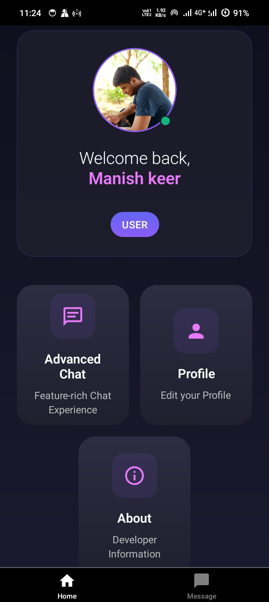
_Native chat interface Home Page_

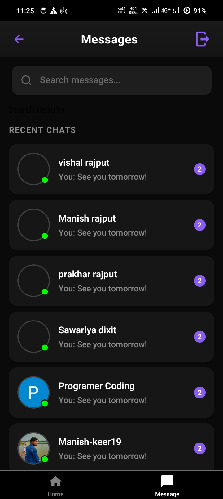
_Chat list with unread message indicators_

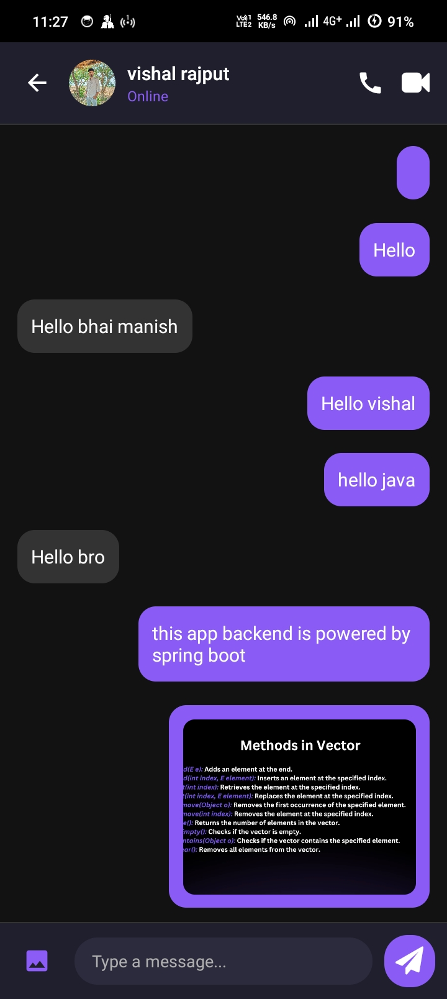
\*One-to-one user chat page with real-time messages and media sharing

### 🖥️ Desktop Chat App

**Cross-platform Desktop Application**

- **Tech Stack:** Electron.js, React, Node.js
- **Features:** Native desktop experience, cross-platform compatibility, system notifications
- **Highlights:** Built with Electron for Windows, macOS, and Linux
- 🔗 [Download](https://github.com/Manish-keer19/chat-web-app/blob/main/README.md) | [Source Code](https://github.com/Manish-keer19/chat-web-app)

**Screenshots:**
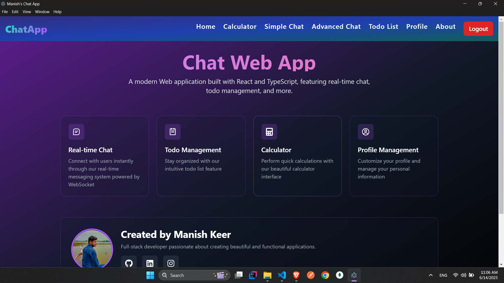
_Desktop chat application interface_

---

## 🌐 Connect With Me

---

## 📊 GitHub Stats

  

---

## 🏆 GitHub Trophies

  

---

## 💡 Dev Quote

  

---

## 📈 Contribution Graph

  

---

## 🔝 Top Contributed Repo

  

---

  
### 👁️ Profile Views

### ⭐ If you like my work, give my repos a star!

---

  

