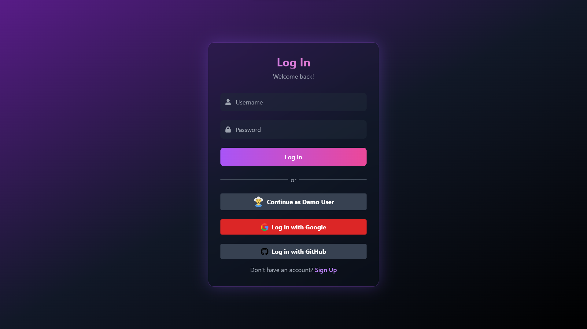

  

    
  

# Hi there, I'm Manish Keer 👋

## 🚀 Full Stack & Android Developer | Building Digital Experiences

> *"Transforming ideas into scalable, real-time applications with modern tech stacks"*

Welcome to my GitHub profile! I'm a passionate developer specializing in full-stack web development and mobile app creation. I love building real-time applications that solve real-world problems and deliver exceptional user experiences.

---

## 🛠️ Tech Stack

### Frontend

### Backend

### Database

### Tools & Platforms

---

## 🌟 Featured Projects

### 🎲 ManishBetting App
**Real-time Gaming Platform**
- **Tech Stack:** MERN Stack, Socket.io, WebSocket,
- **Features:** Real-time betting, wallet system, 30 Seconds games, live results
- **Highlights:** Real-time game mechanics, secure payment processing, live leaderboards
- 🔗 [Live Demo](https://manish-bet-app.vercel.app) | [Source Code](https://github.com/Manish-keer19/Betting_App_Frontend)

**Screenshots:**

*Home page interface Of Betting App*

*User wallet with transaction history*

### 📱 InstaClone
**Social Media Mobile Application**
- **Tech Stack:** React Native CLI, Node.js, MongoDB
- **Features:** Photo sharing, stories, real-time feed, user profiles
- **Highlights:** Native mobile experience, camera integration, social interactions
- 🔗 [Source Code](https://github.com/Manish-keer19/Full_Stack-InstaClone-apk)

**Screenshots:**

*Social media feed with posts and interactions*

*User profile screen with posts grid*

### 💬 ChatWebApplication
**Real-time Messaging Platform**
- **Tech Stack:** MERN Stack, Socket.io, JWT, OAuth
- **Features:** Real-time messaging, Google/GitHub authentication, media sharing, group chats
- **Highlights:** Secure JWT authentication, real-time notifications, responsive design
- 🔗 [Live Demo](https://manishchatapp.vercel.app) | [Source Code](https://github.com/Manish-keer19/chat-web-app)

**Screenshots:**

*Login screen with OAuth integration*

*Main chat interface with real-time messaging*

### 📱 Android Chat App
**Native Mobile Messaging Application**
- **Tech Stack:** React Native CLI, Spring Boot, MongoDB, WebSocket, JWT, OAuth2 (Google/GitHub)
- **Features:** Real-time messaging, OAuth login, media sharing, push notifications, user presence, offline sync, dark/light mode
- **Highlights:** Native Android performance, secure backend, material design UI
- 🔗 [APK Download](https://www.mediafire.com/file/7acyxs5grs88v25/ManishChatApp.apk/file) | [Source Code](https://github.com/Manish-keer19/chatAndroidApp)

**Screenshots:**

*Native chat interface Home Page* 

*Chat list with unread message indicators*

*One-to-one user chat page with real-time messages and media sharing

### 🖥️ Desktop Chat App
**Cross-platform Desktop Application**
- **Tech Stack:** Electron.js, React, Node.js
- **Features:** Native desktop experience, cross-platform compatibility, system notifications
- **Highlights:** Built with Electron for Windows, macOS, and Linux
- 🔗 [Download](https://github.com/Manish-keer19/chat-web-app/blob/main/README.md) | [Source Code](https://github.com/Manish-keer19/chat-web-app)

**Screenshots:**

*Desktop chat application interface*

---

## 🌐 Connect With Me

---

## 📊 GitHub Stats

  

---
## 🏆 GitHub Trophies

  

---

## 💡 Dev Quote

  

---

## 📈 Contribution Graph

  

---

## 🔝 Top Contributed Repo

  

---

  
### 👁️ Profile Views

### ⭐ If you like my work, give my repos a star!

---

  

