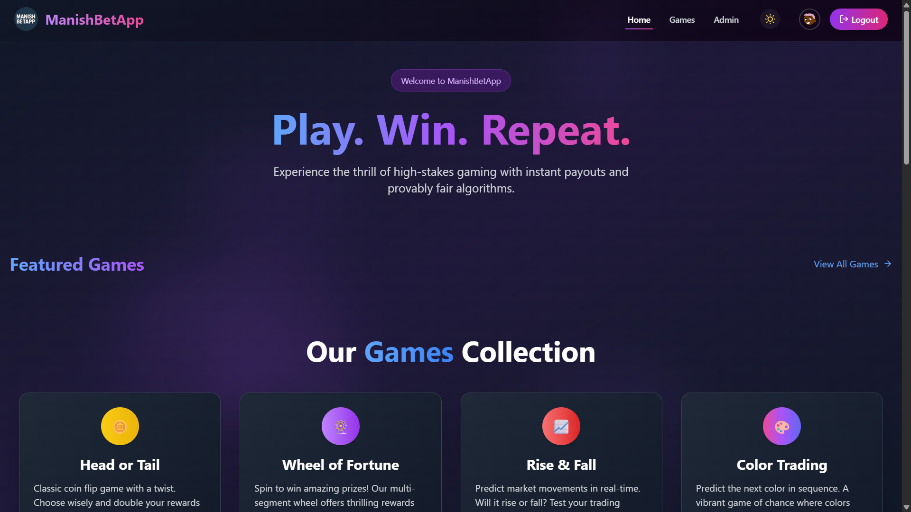

<div align="center">
  
</div>

<div align="center">
  
[](https://git.io/typing-svg)

</div>

---

## 👨‍💻 About Me

<div align="center">

```javascript
const manish = {
    location: "Indore, India 🇮🇳",
    role: "Full Stack Developer",
    education: "BCA @ Medi-Caps University (CGPA: 7.7/10)",
    workStatus: "Available for Full-Time Opportunities",
    
    expertise: {
        frontend: ["React.js", "React Native", "Redux", "TypeScript"],
        backend: ["Node.js", "Express.js", "Spring Boot", "Socket.io"],
        databases: ["MongoDB", "PostgreSQL", "MySQL", "Firebase"],
        realtime: ["WebSockets", "Socket.io", "Server-Sent Events"],
        tools: ["Git", "Docker", "Postman", "Vercel", "Cloudinary"]
    },

    openSource: true,
    collaboration: "Always open to interesting projects!",
    
    contact: {
        email: "manishkeer530[at]gmail[dot]com",
        portfolio: "https://manish-portfolio19.vercel.app",
        linkedin: "manish-keer19"
    }
};
```

</div>

---

## 🎯 Quick Highlights

<div align="center">

| 🚀 | Built **real-time betting platform** serving 100+ concurrent users |
|:---:|:---|
| 📱 | Published production Android apps with **50+ organic downloads** |
| ⚡ | Optimized APIs for **sub-100ms response times** under load |
| 🔐 | Implemented **JWT + OAuth2** authentication systems |
| ☁️ | Deployed full-stack apps with **99.9% uptime** |
| 🌐 | **All projects open source** – community-first approach |

</div>

---

## 🛠️ Tech Stack

<div align="center">

### 💻 Languages


### 🎨 Frontend Development


### ⚙️ Backend Development


### 🗄️ Databases


### 🔧 Tools & Platforms


### 📱 Mobile Development


</div>

---

## 🌟 Featured Projects

<div align="center">

### 🎲 Manish's Bet App
#### Real-Time Betting Platform

<p>
  <a href="https://manish-bet-app.vercel.app" target="_blank">
    
  </a>
  <a href="https://github.com/Manish-keer19/Betting_App_Frontend" target="_blank">
    
  </a>
  <a href="#betting-app-preview">
    
  </a>
</p>


</div>

**✨ Key Features**
- ⚡ Real-time betting engine supporting **100+ concurrent users**
- 🔄 WebSocket-powered live odds synchronization
- 🔐 JWT authentication + secure wallet system
- 📊 Optimized database queries for **<100ms response**
- 🎨 Responsive UI with Redux state management
- 💰 Real-time balance updates & transaction history

<div align="center" id="betting-app-preview">

**📸 Project Screenshots**




</div>

---

<div align="center">

### 💬 Manish Chat App
#### Cross-Platform Messaging Suite

<p>
  <a href="https://manishchatapp.vercel.app" target="_blank">
    
  </a>
  <a href="https://github.com/Manish-keer19/chat-web-app" target="_blank">
    
  </a>
  <a href="https://www.mediafire.com/file/7acyxs5grs88v25/ManishChatApp.apk/file" target="_blank">
    
  </a>
  <a href="#chat-app-preview">
    
  </a>
</p>


</div>

**✨ Key Features**
- 💬 Real-time messaging with typing indicators
- 🔑 OAuth2 authentication (Google & GitHub)
- 👥 User presence & status updates
- 📱 Native Android version with offline sync
- 🖥️ Electron desktop app (Windows/Mac/Linux)
- 🚀 Deployed with **99.9% uptime** on Vercel
- 📨 Message history & search functionality

<div align="center" id="chat-app-preview">

**📸 Project Screenshots**


</div>

---

<div align="center">

### 📱 InstaClone
#### Full-Stack Social Media App

<p>
  <a href="https://github.com/Manish-keer19/Full_Stack-InstaClone-apk" target="_blank">
    
  </a>
  <a href="https://github.com/Manish-keer19/Full_Stack-InstaClone-apk" target="_blank">
    
  </a>
  <a href="#instaclone-preview">
    
  </a>
</p>


</div>

**✨ Key Features**
- 📸 Complete Instagram clone functionality
- 🎬 Posts, Stories, Likes, Comments, Follows
- ☁️ Cloudinary integration processing **500+ images**
- ⚡ RESTful APIs with **30% faster retrieval**
- 🔍 Optimized MongoDB indexing
- 🔐 Secure JWT authentication with refresh tokens
- 📦 Production Android APK with **50+ downloads**
- 👤 User profiles with bio & avatar
- 🔔 Real-time notifications

<div align="center" id="instaclone-preview">

**📸 Project Screenshots**


<br/>


</div>

---

## 📊 GitHub Analytics

<div align="center">


</div>

<br/>

<div align="center">
  
</div>

<br/>

<div align="center">
  
</div>

---

## 🤝 Let's Connect & Collaborate

<div align="center">

**🎯 I'm actively seeking full-time opportunities as a Full Stack Developer**  
**💡 Always open to collaborating on innovative projects!**

<br/>

### 📬 Get In Touch

[](https://manish-portfolio19.vercel.app)
[](https://www.linkedin.com/in/manish-keer19/)
[](https://github.com/Manish-keer19)

[](mailto:manishkeer530@gmail.com)
[](https://www.instagram.com/manish_keer19/)
[](https://x.com/manishkeer_19)

<br/>

### 💼 Open to Opportunities In

**Full Stack Development** • **Backend Engineering** • **Mobile Development**  
**Real-Time Systems** • **Open Source Contribution**

<br/>

### 🌍 Languages Spoken

🇮🇳 **Hindi** (Native) • 🇬🇧 **English** (Professional Working Proficiency)

<br/>

### ⭐ Support My Work

If you find my projects helpful, consider giving them a star! ⭐  
**All my work is 100% open source and free to use.**

<br/>


</div>

---

<div align="center">
  
</div>

<!-- 
Manish Keer | Full Stack Developer | MERN Stack | Spring Boot | Real-Time Applications
React Developer | Node.js Expert | Mobile App Developer | Open Source Enthusiast
Building scalable web and mobile applications | Available for opportunities
-->