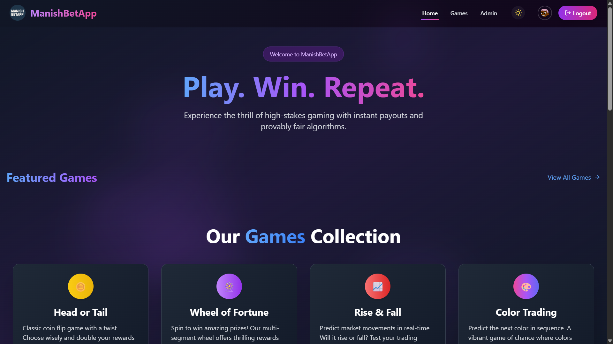
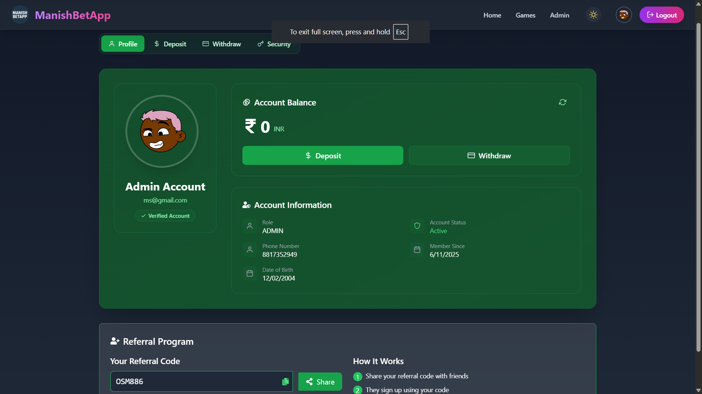
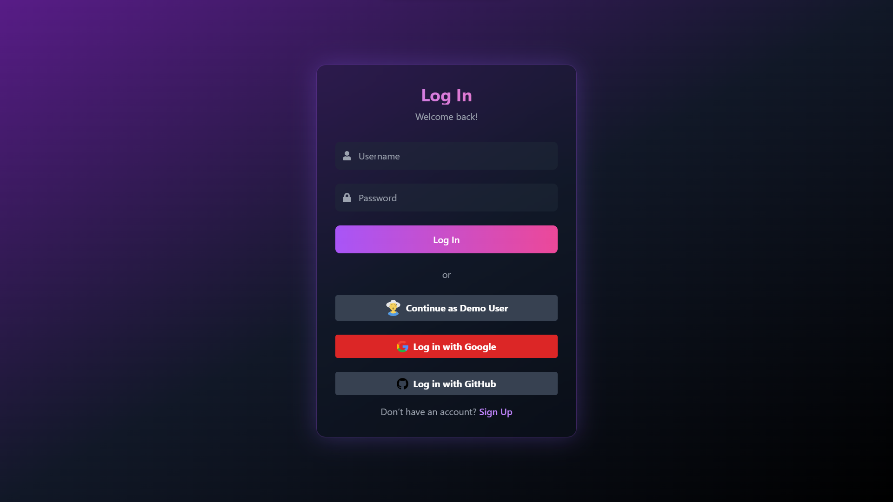
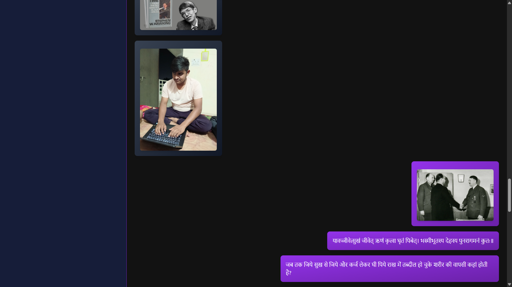
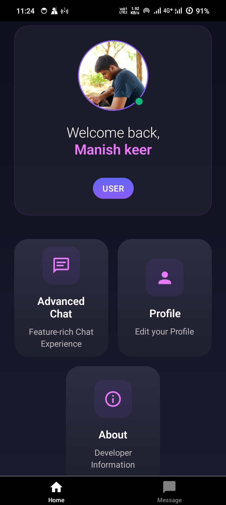
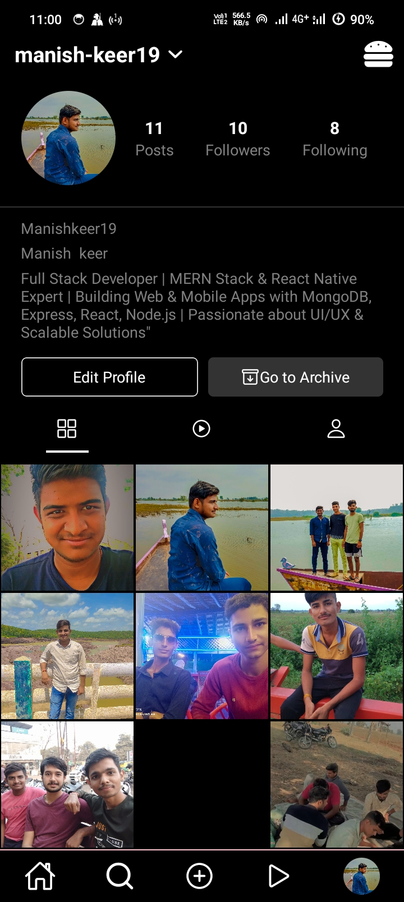

<div align="center">
  
</div>

<div align="center">
  
[](https://git.io/typing-svg)

</div>

---

## 👨‍💻 About Me

```javascript
const manish = {
    location: "Indore, India 🇮🇳",
    role: "Full Stack Developer",
    education: "BCA @ Medi-Caps University (CGPA: 7.7/10)",
    workStatus: "Available for Full-Time Opportunities",
    
    expertise: {
        frontend: ["React.js", "React Native", "Redux", "TypeScript"],
        backend: ["Node.js", "Express.js", "Spring Boot", "Socket.io"],
        databases: ["MongoDB", "PostgreSQL", "MySQL", "Firebase"],
        realtime: ["WebSockets", "Socket.io", "Server-Sent Events"],
        tools: ["Git", "Docker", "Postman", "Vercel", "Cloudinary"]
    },
    
    currentFocus: "Building production-ready real-time applications",
    openSource: true,
    collaboration: "Always open to interesting projects!",
    
    contact: {
        email: "manishkeer530[at]gmail[dot]com",
        portfolio: "https://manish-portfolio19.vercel.app",
        linkedin: "manish-keer19"
    }
};
```

<div align="center">

### 🎯 Quick Highlights

🚀 Built **real-time betting platform** serving 100+ concurrent users  
📱 Published production Android apps with **50+ organic downloads**  
⚡ Optimized APIs for **sub-100ms response times** under load  
🔐 Implemented **JWT + OAuth2** authentication systems  
☁️ Deployed full-stack apps with **99.9% uptime**  
🌐 **All projects open source** – community-first approach

</div>

---

## 🛠️ Tech Stack

<table>
<tr>
<td valign="top" width="33%">

### Frontend
<div align="center">

</div>

</td>
<td valign="top" width="33%">

### Backend
<div align="center">

</div>

</td>
<td valign="top" width="33%">

### Database & Tools
<div align="center">

</div>

</td>
</tr>
</table>

---

## 🌟 Featured Projects

### 🎲 [Manish's Bet App](https://manish-bet-app.vercel.app) - Real-Time Betting Platform
> **Live Demo** • [Frontend Code](https://github.com/Manish-keer19/Betting_App_Frontend)

**Built with:** `Node.js` `React` `WebSocket` `MongoDB` `Express.js` `Redux`

- ⚡ Real-time betting engine supporting **100+ concurrent users**
- 🔄 WebSocket-powered live odds synchronization with instant updates
- 🔐 JWT authentication + secure wallet transaction system
- 📊 Optimized database queries for **<100ms response times**
- 🎨 Responsive UI with Redux state management

<details>
<summary>📸 View Screenshots</summary>
<br/>


</details>

---

### 💬 [Manish Chat App](https://manishchatapp.vercel.app) - Cross-Platform Messaging Suite
> **Live Demo** • [Web Code](https://github.com/Manish-keer19/chat-web-app) • [Android APK](https://www.mediafire.com/file/7acyxs5grs88v25/ManishChatApp.apk/file)

**Built with:** `React` `Spring Boot` `WebSocket` `MongoDB` `OAuth2` `React Native`

- 💬 Real-time messaging with typing indicators & user presence
- 🔑 OAuth2 authentication (Google & GitHub) + JWT
- 📱 Native Android version with **offline message sync**
- 🖥️ Electron desktop app for Windows/Mac/Linux
- 🚀 Deployed with **99.9% uptime** on Vercel

<details>
<summary>📸 View Screenshots</summary>
<br/>



</details>

---

### 📱 [InstaClone](https://github.com/Manish-keer19/Full_Stack-InstaClone-apk) - Full-Stack Social Media App
> [Download APK](https://github.com/Manish-keer19/Full_Stack-InstaClone-apk) • [Source Code](https://github.com/Manish-keer19/Full_Stack-InstaClone-apk)

**Built with:** `React Native CLI` `Express.js` `MongoDB` `Cloudinary` `JWT`

- 📸 Complete Instagram clone: posts, stories, likes, comments
- ☁️ Cloudinary integration processing **500+ images**
- ⚡ RESTful APIs with **30% faster data retrieval** via indexing
- 🔐 Secure JWT authentication with token refresh
- 📦 Production Android APK with **50+ downloads**

<details>
<summary>📸 View Screenshots</summary>
<br/>


</details>

---

## 📊 GitHub Analytics

<div align="center">
  
  
</div>

<div align="center">
  
</div>

<div align="center">
  
</div>

---

## 🎯 Currently Working On

```yaml
🔨 Developing: Real-time collaborative coding platform with WebRTC
📚 Learning: Microservices architecture with Kubernetes & Docker
🎨 Improving: System design patterns & scalability optimization
🤝 Collaborating: Open to contributing to impactful open-source projects
```

---

## 🎓 Learning & Interests

<div align="center">

🌱 **Currently Exploring:** Kubernetes • System Design • GraphQL • Microservices  
💡 **Interested In:** WebRTC • Cloud Architecture • DevOps • AI Integration  
🎯 **Goals:** Contribute to large-scale open source • Build SaaS products

</div>

---

## 🤝 Let's Connect & Collaborate

<div align="center">

I'm actively seeking **full-time opportunities** as a Full Stack Developer and always open to collaborating on innovative projects!

<br/>

[](https://manish-portfolio19.vercel.app)
[](https://www.linkedin.com/in/manish-keer19/)
[](https://github.com/Manish-keer19)

[](mailto:manishkeer530@gmail.com)
[](https://www.instagram.com/manish_keer19/)
[](https://x.com/manishkeer_19)

<br/>

### 💼 Open to Opportunities In

`Full Stack Development` • `Backend Engineering` • `Mobile Development` • `Real-Time Systems` • `Open Source`

### 🌍 Languages
**English** (Professional Working Proficiency) • **Hindi** (Native)

<br/>

### ⭐ Support My Work

If you find my projects helpful, consider giving them a star! All my work is **100% open source** and free to use.

<br/>

</div>

---

<div align="center">

### 📈 Profile Stats


---

*"Code is like humor. When you have to explain it, it's bad."* – Cory House

---

</div>

<div align="center">
  
</div>

<!-- SEO Keywords: Full Stack Developer, MERN Stack, React Developer, Node.js Developer, Spring Boot, Real-Time Applications, WebSocket, MongoDB, Java Developer, React Native, Open Source, Indore Developer, JavaScript Expert, TypeScript, REST API, Microservices -->

