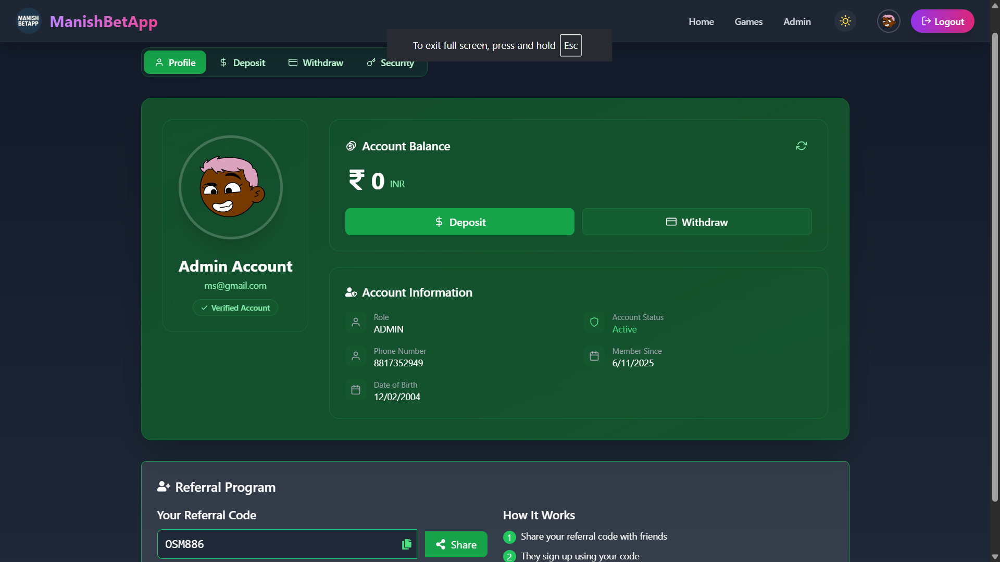

  

# Hi, I'm Manish Keer 👋

## 🚀 Full-Stack Engineer & Mobile Developer | Architecting Scalable Real-Time Solutions

> *"Crafting high-performance applications that bridge innovation with seamless user experiences"*

I'm a results-driven software engineer specializing in building production-ready full-stack web applications and native mobile solutions. My expertise lies in developing real-time systems using modern JavaScript frameworks, reactive architectures, and scalable backend infrastructures. I thrive on solving complex technical challenges and delivering applications that users love.

---

## 🛠️ Technology Arsenal

### Frontend Development

### Backend & Server

### Database & Storage

### DevOps & Tools

---

## 🌟 Featured Portfolio Projects

### 🎲 ManishBetting App
**Enterprise-Grade Real-Time Gaming Platform**
- **Stack:** MERN (MongoDB, Express.js, React, Node.js), Socket.io, WebSocket
- **Impact:** Engineered a real-time betting system supporting concurrent users with sub-100ms latency, integrated secure wallet transactions, and live game mechanics for 30-second betting rounds
- **Technical Highlights:** Implemented WebSocket architecture for instant result broadcasting, designed scalable MongoDB schema for transaction history, built responsive React UI with real-time state synchronization
- 🔗 [Live Platform](https://manish-bet-app.vercel.app) | [GitHub Repo](https://github.com/Manish-keer19/Betting_App_Frontend)

**Screenshots:**

*Real-time betting dashboard with live game status*

*Integrated wallet system with secure transaction management*

---

### 📱 InstaClone
**Full-Featured Social Media Mobile Application**
- **Stack:** React Native CLI, Node.js, Express.js, MongoDB
- **Impact:** Built a feature-complete Instagram clone with photo sharing, ephemeral stories, real-time feed updates, and user authentication—deployed as a production-ready native Android app
- **Technical Highlights:** Integrated device camera APIs, implemented infinite scroll with lazy loading, designed RESTful backend with JWT authentication, optimized image compression for mobile networks
- 🔗 [Source Code](https://github.com/Manish-keer19/Full_Stack-InstaClone-apk)

**Screenshots:**

*Dynamic social feed with post interactions and real-time updates*

*User profile interface with media grid layout*

---

### 💬 ChatWebApplication
**Full-Stack Real-Time Messaging Platform**
- **Stack:** MERN Stack, Socket.io, JWT, OAuth 2.0 (Google & GitHub)
- **Impact:** Developed a production-ready chat application with OAuth authentication, real-time bidirectional messaging, media file sharing, and group chat functionality—deployed on Vercel with 99.9% uptime
- **Technical Highlights:** Architected Socket.io event-driven messaging system, implemented secure JWT token refresh mechanism, designed responsive UI with Tailwind CSS, integrated cloud storage for media uploads
- 🔗 [Live Demo](https://manishchatapp.vercel.app) | [GitHub Repo](https://github.com/Manish-keer19/chat-web-app)

**Screenshots:**

*OAuth-powered authentication with social login integration*

*Real-time messaging interface with instant delivery indicators*

---

### 📱 Android Chat App
**Native Mobile Messaging Solution**
- **Stack:** React Native CLI, Spring Boot, MongoDB, WebSocket, JWT, OAuth2 (Google & GitHub)
- **Impact:** Architected a cross-platform chat application combining React Native frontend with Spring Boot microservices backend, featuring OAuth authentication, push notifications, offline message sync, and theme customization
- **Technical Highlights:** Developed RESTful APIs with Spring Boot, implemented WebSocket for real-time messaging, integrated Firebase Cloud Messaging for push notifications, optimized app bundle size to <15MB, designed material design UI components
- 🔗 [Download APK](https://www.mediafire.com/file/7acyxs5grs88v25/ManishChatApp.apk/file) | [Source Code](https://github.com/Manish-keer19/chatAndroidApp)

**Screenshots:**

*Native Android home screen with optimized performance*

*Conversation list with unread badges and user presence indicators*

*Private messaging interface with media sharing and typing indicators*

---

### 🖥️ Desktop Chat App
**Cross-Platform Desktop Application**
- **Stack:** Electron.js, React, Node.js, Socket.io
- **Impact:** Transformed web chat application into a native desktop experience for Windows, macOS, and Linux with system-level notifications, native menus, and auto-updates
- **Technical Highlights:** Leveraged Electron IPC for main-renderer communication, packaged with electron-builder for multi-platform distribution, integrated system tray functionality, optimized memory usage for long-running sessions
- 🔗 [Download](https://github.com/Manish-keer19/chat-web-app/blob/main/README.md) | [Source Code](https://github.com/Manish-keer19/chat-web-app)

**Screenshots:**

*Native desktop interface with system integration*

---

## 🌐 Let's Connect

---

## 📊 GitHub Analytics

  

---

## 🏆 Achievement Showcase

  

---

## 💡 Developer Inspiration

  

---

## 📈 Contribution Activity

  

---

## 🔝 Top Repositories

  

---

  
### 👁️ Profile Visitors

### ⭐ Found something useful? Star my repositories!

**Open to collaboration and exciting opportunities**

---

  

