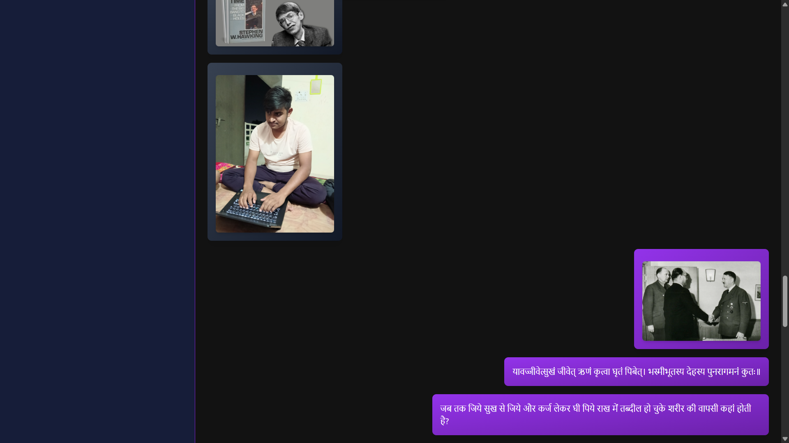
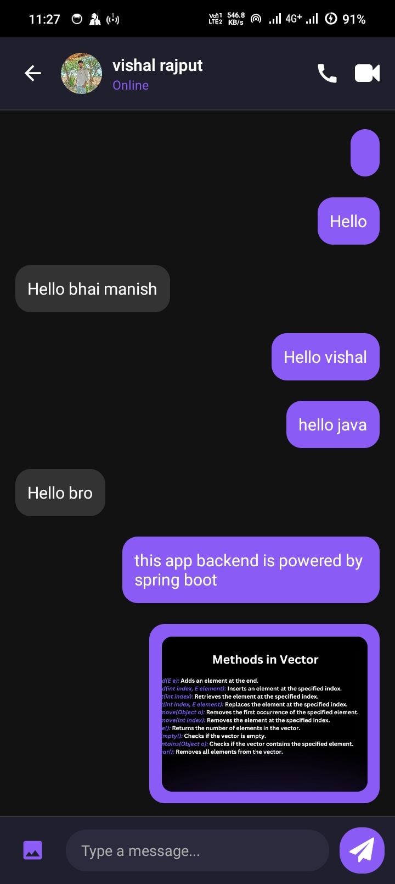

#  Hey there! I'm Manish Keer

<div align="center">

[](https://git.io/typing-svg)

</div>


### 🚀 About Me

```javascript
const manish = {
    pronouns: "He/Him",
    location: "India 🇮🇳",
    code: ["JavaScript", "Java", "Python", "Dart"],
    askMeAbout: ["Web Dev", "Mobile Dev", "Real-time Apps", "System Design"],
    technologies: {
        frontEnd: {
            js: ["React", "React Native", "Electron.js"],
            css: ["Tailwind CSS", "Material UI", "Styled Components"]
        },
        backEnd: {
            js: ["Node.js", "Express.js"],
            java: ["Spring Boot", "Spring Security"],
            databases: ["MongoDB", "Firebase", "PostgreSQL"],
            realTime: ["Socket.io", "WebSocket", "Server-Sent Events"]
        },
        devOps: ["Docker", "GitHub Actions", "AWS", "Vercel"],
        mobile: ["React Native CLI", "Android Studio", "Flutter"]
    },
    currentFocus: "Building scalable real-time applications",
    funFact: "I debug with console.log() and I'm proud of it! 😄"
};
```

<br clear="both">

---

## ⚡ Tech Stack

<div align="center">

### Frontend Development


### Backend Development


### Database & Real-Time


### DevOps & Tools


</div>

---

## 🏗️ Featured Projects

<div align="center">

### 🎲 ManishBetting App
*Real-time Gaming Platform*


*Home page interface Of Betting App*


*User wallet with transaction history*

🔹 **Real-time betting & 30 Seconds games**  
🔹 **Secure wallet system with transaction history**  
🔹 **Live betting with WebSocket technology**  
🔹 **Live results & leaderboards**  
🔹 **Secure payment processing**  


[](https://manish-bet-app.vercel.app)
[](https://github.com/Manish-keer19/Betting_App_Frontend)

---

### 📱 InstaClone
*Social Media Mobile Application*


*Social media feed with posts and interactions*


*User profile screen with posts grid*

🔹 **Photo sharing & stories functionality**  
🔹 **Real-time feed & social interactions**  
🔹 **Native mobile experience**  
🔹 **Camera integration & user profiles**  


[](https://github.com/Manish-keer19/Full_Stack-InstaClone-apk)

---

### 💬 ChatWebApplication
*Real-time Messaging Platform*


*Login screen with OAuth integration*


*Main chat interface with real-time messaging*

🔹 **Real-time messaging with Socket.io**  
🔹 **JWT Authentication & OAuth (Google/GitHub)**  
🔹 **Media sharing & group chats**  
🔹 **Real-time notifications & responsive design**  


[](https://manishchatapp.vercel.app)
[](https://github.com/Manish-keer19/chat-web-app)

---

### 📱 Android Chat App
*Native Mobile Messaging Application*


*Native chat interface Home Page*


*Chat list with unread message indicators*


*One-to-one user chat page with real-time messages and media sharing*

🔹 **Native Android performance**  
🔹 **Real-time messaging & OAuth login**  
🔹 **Media sharing & push notifications**  
🔹 **User presence & offline sync**  
🔹 **Dark/light mode & material design UI**  


[](https://www.mediafire.com/file/7acyxs5grs88v25/ManishChatApp.apk/file)
[](https://github.com/Manish-keer19/chatAndroidApp)

---

### 🖥️ Desktop Chat App
*Cross-platform Desktop Application*


*Desktop chat application interface*

🔹 **Native desktop experience**  
🔹 **Cross-platform compatibility (Windows, macOS, Linux)**  
🔹 **Built with Electron.js**  
🔹 **System notifications & seamless integration**  


[](https://github.com/Manish-keer19/chat-web-app/blob/main/README.md)
[](https://github.com/Manish-keer19/chat-web-app)

</div>

---

## 📊 GitHub Analytics

<div align="center">


</div>

---

## 🏆 GitHub Achievements

<div align="center">

[](https://github.com/ryo-ma/github-profile-trophy)

</div>

---

## 📈 Contribution Graph

<div align="center">

[](https://github.com/ashutosh00710/github-readme-activity-graph)

</div>

---

## 💭 Dev Quote

<div align="center">

[](https://github.com/piyushsuthar/github-readme-quotes)

</div>

---

## 🌟 What I'm Up To

```yaml
current_work: "Building scalable real-time applications"
learning: "Microservices Architecture & System Design"
collaborating: "Open source projects in React ecosystem"
ask_me_about: "Web Development, Mobile Apps, Real-time Systems"
fun_fact: "I can debug code faster than I can explain the bug! 🐛"
```

---

## 🤝 Connect With Me

<div align="center">

[](https://linkedin.com/in/manish-keer)
[](https://twitter.com/manishkeer)
[](https://instagram.com/manishkeer)
[](https://manishkeer.dev)
[](mailto:manishkeer@example.com)

</div>

---

<div align="center">

### 🎯 Profile Stats


### ⭐ Show some love by starring my repositories!

**💼 Open for interesting project collaborations**  
**📧 Feel free to reach out for freelance opportunities**

---


---

*💡 "Code is like humor. When you have to explain it, it's bad." – Cory House*

**Happy Coding! 🚀**

</div>